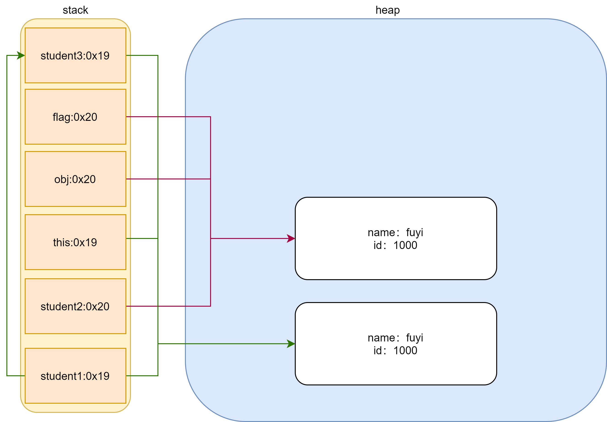

# 第十一章 常用类的概述和使用

## 11.1 常用包

### 11.1.1 包名和名称

- java.lang 包，由虚拟机自动导入
 
- java.util 包，包含集合框架，一些国际化支持类，服务加载程序，属性，随机数生成，字符串解析和扫描类，base64编码和解码，位数组以及几个其他实用程序类。

- java.math 包，提供用于执行任意精度整数算术（BigInteger）和任意精度十进制算术（BigDecimal）的类

- java.nio 定义缓冲区，缓冲区是数据的容器，并提供其他NIO包的概述。

- java.io包， 通过数据流，序列化和文件系统提供系统输入和输出

## 11.2 Object类（重点）

### 11.2.1 基本概述

   Object类是所有类的基类，所有对象和数组都继承实现Object类的方法。
   
   ```java
    public class MyClass{} 
   ```   
   等价于  
   
   ```java
   public class MyClass extends Object {}
   ```

### 11.2.2 equals方法

- public boolean equals​(Object obj)

    返回其他某个对象是否“等于”该对象的比较结果

- 代码测试
  
  创建student类

  ```Java
  public class Student {

    private String name;

    private int id;

    public Student(String name, int id) {
        this.name = name;
        this.id = id;
    }

    public String getName() {
        return name;
    }

    public void setName(String name) {
        this.name = name;
    }

    public int getId() {
        return id;
    }

    public void setId(int id) {
        this.id = id;
    }

    @Override
    public boolean equals(Object obj) {
        //当如果两个对象指向同一个地址引用的时候，一定为true
        if (this == obj) {
            return true;
        }

        //当传入的对象为null时候，一定是为false
        if (obj == null) {
            return false;
        }

        //重写equals方法用来实现两个对象ID的比较
        if (obj instanceof Student) {
            Student flag = (Student) obj;
            return this.id == flag.getId();
        }
        return false;
    }

    @Override
    public int hashCode() {
        return getId();
    }
  }
  ```

 测试代码

 ```Java
 //创建两个student对象
  Student student1 = new Student("fuyi", 1000);
  Student student2 = new Student("fuyi", 1000);
  Student student3 = student1;

  System.out.println("-------------------------equals()--------------------------");

  //1. 调用Object类中equals方法
  //2. 通过下面两种方式进行测试Object类的equals方法，用来比较的是两个对象的引用是否相等
  //3. Object类源码层次
  /**
    * public boolean equals(Object obj) {
    *         return (this == obj);
    *     }
   */
  //4. 如果通过equals方法比较两个对象的id是否相等，则需要重写Object基类的equals方法
  System.out.println(student1.equals(student2));       //false -> true
  System.out.println(student1 == student2);            //false
  System.out.println(student3 == student1);            //true
 ```

 内存分析
 
 

### 11.2.3 hashCode方法

- public int hashCode()
  
  返回对象的哈希码值。支持此方法是为了使哈希表（例如HashMap提供的哈希表）提供协助功能。就是在后面集合HashMap存储元素的时候会调用该方法。

- 代码测试

  重写自定义类中的hashCode（）方法
    
    ```java
    @Override
    public boolean equals(Object o) {
        if (this == o) return true;
        if (o == null || getClass() != o.getClass()) return false;
        Student student = (Student) o;
        return id == student.id &&
                Objects.equals(name, student.name);
    }
  
    @Override
    public int hashCode() {
        return Objects.hash(name, id);
    }
    ```
  
  运行测试
  
  ```java
  System.out.println("------------------------hashCode()--------------------------");
  
  //1. 调用Object类中的hashCode()方法
  //2. Java官方常规约束，调用equals（）方法比较的结果的相同，那么调用hashCode（）获取两个对象的结果也应该相同，所以我们需要重写基类中的hashCode()方法
  //3. 这里只要求约束为equals比较结果相等的两个对象，调用hashCode方法结果也相等就可以了
  System.out.println(student1.hashCode());            //1300109446  ->  1000
  System.out.println(student2.hashCode());            //1020371697  ->  1000
  ```
  
  
### 11.2.3 toString方法

- public String toString()

    返回对象的字符串表示形式。 通常，toString方法返回一个“以文本形式表示”此对象的字符串。 结果应该是简洁易懂的表示形式，便于人们阅读。 
    建议所有子类都重写此方法。 Object类的toString方法返回一个字符串，该字符串包括该对象是其实例的类的名称，符号字符“ @”以及该对象的
    哈希码的无符号十六进制表示形式。 换句话说，此方法返回的字符串等于：
        getClass().getName() + '@' + Integer.toHexString(hashCode())
    
- 代码测试

  重写Student类中toString()方法
  
  ```java
  @Override
  public String toString() {
      return "Student{" +
              "name='" + name + '\'' +
              ", id=" + id +
              '}';
  }
  ```
  
  运行打印
  
  ```java
  System.out.println("------------------------toString()---------------------------");
  
  //1. 调用Object类中的toString()方法
  //2. 为了返回更有意义的字符串信息需要重写toString()方法
  //3. 直接打印对象和字符串拼接，默认调用toString方法
  System.out.println(student1.toString());           //com.ryan.stage1.model3.task11.Student@3e8  ->  Student{name='fuyi', id=1000}
  System.out.println(student2.toString());           //com.ryan.stage1.model3.task11.Student@3e8  ->  Student{name='fuyi', id=1000}
  System.out.println(student1);                      //com.ryan.stage1.model3.task11.Student@3e8  ->  Student{name='fuyi', id=1000}
  System.out.println(student2);                      //com.ryan.stage1.model3.task11.Student@3e8  ->  Student{name='fuyi', id=1000}
  System.out.println("打印结果：" + student1);        //打印结果：com.ryan.stage1.model3.task11.Student@3e8  ->  打印结果：Student{name='fuyi', id=1000}
  System.out.println("打印结果：" + student2);        //打印结果：com.ryan.stage1.model3.task11.Student@3e8  ->  打印结果：Student{name='fuyi', id=1000}
  ```

### 11.2.4 getClass方法
- public final Class<?> getClass()

  返回此对象的运行时类。返回的Class对象是被表示的类的静态同步方法锁定的对象
  
- 代码demo

  ```java
  System.out.println("------------------------getClass()----------------------------");
  
  //1. 获取该对象的实例，常用于反射机制
  System.out.println(student1.getClass());           //class com.ryan.stage1.model3.task11.Student
  System.out.println(student2.getClass());           //class com.ryan.stage1.model3.task11.Student
  ```
 

### 11.2.5 自动重写equals、hashCode和toString方法
- Idea编辑器快捷键
  
  window：alt + insert快捷键

## 11.3 包装类（熟悉）

- 背景
  
  在 Java 的设计中提倡一种思想，即一切皆对象。但是从数据类型的划分中，我们知道 Java 中的数据类型分为基本数据类型和引用数据类型，
  但是基本数据类型怎么能够称为对象呢？于是 Java 为每种基本数据类型分别设计了对应的类，称之为包装类（Wrapper Classes），也有地方称为外覆类或数据类型类。
  

### 11.3.1 基本概念

Java给每一种基本数据类型进一步封装成了一个类，这个类就叫做包装类。

- 映射关系

    ```text
      byte    ->    Byte
      
      short   ->    Short
      
      int     ->    Integer
      
      long    ->    Long
      
      char    ->    Character
      
      float   ->    Float
      
      double  ->    Double
      
      boolean ->    Boolean
    ```
  
### 11.3.2 装箱与拆箱

基本数据类型转换为包装类的过程称为装箱，例如把 int 包装成 Integer 类的对象(int -> Integer)；

包装类变为基本数据类型的过程称为拆箱，例如把 Integer 类的对象重新简化为 int(Integer -> int)。
  
### 11.3.3 Integer类的构造方式

- 代码demo

  ```java
  System.out.println("-------------------Integer类常见属性成员---------------------");
  
  System.out.println("占用字节数：" + Integer.BYTES);                              //占用字节数：4
  System.out.println("最大表示正数：" + Integer.MAX_VALUE);                        //最大表示正数：2147483647
  System.out.println("最大表示负数：" + Integer.MIN_VALUE);                        //最大表示负数：-2147483648
  System.out.println("用于表示二进制补码二进制形式的int值的位数：" + Integer.SIZE);   //用于表示二进制补码二进制形式的int值的位数：32
  System.out.println("表示原始类型int的Class实例：" + Integer.TYPE);                //表示原始类型int的Class实例：int

  System.out.println("-------------------Integer构造方法-----------------------");

  //1. Integer(int i)构造
  //2. Integer(String s) 构造
  //3. 上述两种构造在JDK9已经被遗弃，提供了静态工厂构造方法valueOf(int i)和valueOf(String s)
  Integer integer1 = new Integer(123456);
  Integer integer2 = new Integer("789");
  Integer integer3 = Integer.valueOf(123456);
  Integer integer4 = Integer.valueOf("789");
  ```

### 11.3.4 Integer类的装箱和拆箱机制

- 代码demo

  ```java
  System.out.println("-----------------Integer类的装箱和拆箱机制-----------------------------------------------");
  
  //JDK5 新增自动拆装箱机制
  //1. int -> Integer  装箱
  //自动装箱
  Integer integer5 = 100;

  //2. Integer -> int 拆箱
  //自动拆箱
  int i5 = integer5;
  ```
  
- 笔试考点

  ```java
  //3. 笔试考点
  //主要考察自动装箱池机制，JVM自动将-128到127的正数进行提前装箱，当调用到时，直接赋引用地址调用池中的对象，提高效率
  //Double类没有自动装箱池
  Integer integer6 = 127;                                                        //128 -> 127
  Integer integer7 = 127;                                                        //128 -> 127
  Integer integer8 = new Integer(127);                                           //128 -> 127
  Integer integer9 = new Integer(127);                                           //128 -> 127
  System.out.println(integer6 == integer7);                                      //false -> true
  System.out.println(integer6.equals(integer7));                                 //true -> true
  System.out.println(integer8 == integer9);                                      //false -> false
  System.out.println(integer8.equals(integer9));                                 //true -> true
  ```
  
### 11.3.5 Integer、int和String类型之间转换

- 代码demo

  ```java
  System.out.println("------------------Integer、int和String类型之间转换-------------------------------");
  
  //1. Integer和int之间转换，int转成Integer使用构造方法进行转换
  int intValue = integer1.intValue();
  System.out.println("Integer -> int ：" + intValue);                             //Integer -> int ：123456

  //2. Integer -> String
  String s = integer2.toString();
  System.out.println("Integer -> String ：" + s);                                 //Integer -> String ：789

  //3. String -> int
  int i = Integer.parseInt("345");
  System.out.println("String -> int ：" + i);                                     //String -> int ：345

  //4. int -> String
  System.out.println("int -> String ：" + Integer.toString(98));                  //int -> String ：98

  System.out.println("int -> String ：" + Integer.toBinaryString(98));            //int -> String ：1100010
  ```

### 11.3.5 Double类

各个基本数据类型的包装类的方法都大同小异，就不再加以论述了。

- 常用方法

  ```java
  System.out.println("---------------------常用方法------------------------");
  
  //1. 判断是否为非数值
  Double double1 = new Double(187.293847);
  double v = Double.parseDouble("18.983");
  System.out.println("是否为非数值：" + double1.isNaN());               //是否为非数值：false
  System.out.println("是否为非数值：" + Double.isNaN(v));               //是否为非数值：false
  ```

### 11.3.6 Boolean类

- Boolean类的自动装箱和自动拆箱
 
  ```java
  System.out.println("----------------Boolean类的自动装箱和自动拆箱----------------");
  //1. JDK5之前
  //装箱
  Boolean boolean1 = Boolean.valueOf("true");
  System.out.println(boolean1);                           //true
  //拆箱
  boolean b = boolean1.booleanValue();
  System.out.println(b);                                  //true

  //2. JDK5之后
  //自动装箱和自动拆箱
  Boolean boolean2 = false;
  boolean b2 = boolean2;
  System.out.println(b2);                                 //false
  ```

### 11.3.7 wrapper类总结

- 基本类型转换为包装类的方式：调用构造和静态方法；

- 获取包装类中的基本数据类型方式：调用包装类中xxxValue方法即可；

- 字符串转基本数据类型的方式：调用包装类中的parseXxx方法


## 11.4 数学处理类（熟悉）

### 11.4.1 Math类概念

用于提供执行数学运算的方法

### 11.4.2 BigDecimal类

- 背景
  
  通常平时我们使用double和float类型做加减乘除运算的时候不能很精确，BigDecimal类就可以很好的解决这个问题。

- 构造方法

  ```java
  System.out.println("-----------------构造方法--------------------");
  
  BigDecimal bigDecimal1 = new BigDecimal("1.5");
  BigDecimal bigDecimal2 = new BigDecimal("1.25");
  ```
- 常用方法

  ```java
  System.out.println("-----------------常用方法--------------------");
  
  System.out.println("加法运算：" + bigDecimal1.add(bigDecimal2));        //2.75
  System.out.println("减法运算：" + bigDecimal1.subtract(bigDecimal2));   //0.25
  System.out.println("乘法运算：" + bigDecimal1.multiply(bigDecimal2));   //1.875
  System.out.println("除法运算：" + bigDecimal1.divide(bigDecimal2));     //1.2
  ```
  
- 注意事项
  
  ```java
  System.out.println("-----------------注意事项---------------------");
  
  BigDecimal bigDecimal3 = new BigDecimal("1.5");
  BigDecimal bigDecimal4 = new BigDecimal("1.3");
  System.out.println("除不尽小数处理：" + bigDecimal3.divide(bigDecimal4, RoundingMode.HALF_UP)); //1.2
  ```

### 11.4.3 BigInteger类概念

- 背景
 
  有些时候long类型不能表示数可以使用BigInteger类进行，毕竟long类型表示的范围是有限的。
  
- 构造方法

  ```java
  System.out.println("-----------------构造方法--------------------");
  
  BigInteger bigInteger1 = new BigInteger("5");
  BigInteger bigInteger2 = new BigInteger("3");
  ```
  
- 常用方法

  ```java
  System.out.println("-----------------常用方法--------------------");
  
  System.out.println("加法运算：" + bigInteger1.add(bigInteger2));                        //8
  System.out.println("减法运算：" + bigInteger1.subtract(bigInteger2));                   //2
  System.out.println("乘法运算：" + bigInteger1.multiply(bigInteger2));                   //15
  System.out.println("除法运算：" + bigInteger1.divide(bigInteger2));                     //1

  BigInteger[] bigIntegers = bigInteger1.divideAndRemainder(bigInteger2);
  System.out.println("除法运算一次性获取商和小数：");

  for (BigInteger bigInteger : bigIntegers) {
      System.out.println(bigInteger.floatValue());                                       //1.0 2.0
  }
  ```

# 第十二章 String类的概述和常用方法使用

## 12.1 String类的概念（重点）

String类表示字符串。 Java程序中的所有字符串文字（例如“ abc”）都实现为此类的实例。 字符串是常量； 它们的值在创建后无法更改。 字符串缓冲区支持可变字符串。 由于String对象是不可变的，因此可以共享它们。 例如：

   
    String str = "abc";
  
 
等价于:

     char data[] = {'a', 'b', 'c'};
     String str = new String(data);

## 12.2 常量池的概念（原理）

因为字符串是通过final关键字修饰的常量，因此JVM将首次出现的字符串放入到常量池里面，如果后续代码中再次出现相同的字符串，直接使用常量池里面的对象，从而避免申请空间再次创建对象，节省资源开销和提高性能。从另一方面可以得出String类字符串在底层是实现资源共享机制的。

## 12.3 常用构造方法（熟练）

- 代码demo

  ```java
  System.out.println("----------------常用构造方法------------------");
  
  //1. 无参构造方法
  //结果：创建了对象，但是对象里面没有内容
  String str1 = new String();
  System.out.println("无参构造打印：" + str1);       //""

  //2. 通过字节数组构造
  byte[] arr = {97, 98, 99, 100, 101};             //abcde
  String str2 = new String(arr);
  System.out.println("字节数组构造：" + str2);       //abcde

  String str3 = new String(arr, 2, 2);//cd
  System.out.println("字节数组构造：" + str3);

  //3. 通过字符数组构造
  char[] brr = {'a', 'b', 'c', 'd', 'e'};
  String str4 = new String(brr);
  System.out.println("字符数组构造：" + str2);       //abcde

  String str5 = new String(brr, 2, 3);
  System.out.println("字符数组构造：" + str5);       //cde

  //4. 字符串构造方法
  String str6 = new String("hello world");
  System.out.println("字符串数组构造：" + str6);      //hello world
  ```

## 12.4 String类笔试考点

- 代码demo

  ```java
  System.out.println("------------------笔试常考内容------------------");
  
  //1. 常量池和堆区的内容比较
  String str1 = "abcd";                          //该过程创建一个对象
  String str2 = "abcd";
  String str3 = new String("abcd");      //该过程创建两个对象（1个在常量池中，1个在堆区里面）
  String str4 = new String("abcd");

  System.out.println(str1 == str2);              //true
  System.out.println(str1.equals(str2));         //true
  System.out.println(str3 == str4);              //false
  System.out.println(str3.equals(str4));         //true
  System.out.println(str1 == str3);              //false
  System.out.println(str1.equals(str3));         //true

  System.out.println("----------------------------------------------------");

  //2. 字符串拼接比较
  String str5 = "abcd";
  String str6 = "abc" + "d";

  System.out.println(str5 == str6);              //true
  System.out.println(str5.equals(str6));         //true
  System.out.println(str6 == str3);              //false
  System.out.println(str6.equals(str3));         //true

  System.out.println("----------------------------------------------------");

  //3. 变量与常量拼接比较
  String str7 = "ab";
  String str8 = str7 + "cd";

  System.out.println(str1 == str8);             //false
  System.out.println(str8.equals(str1));        //true
  System.out.println(str8 == str3);             //false
  System.out.println(str8.equals(str3));        //true
  ```

## 12.5 String回文判断

- 代码demo

  ```java
  System.out.println("------------String回文判断--------------");
  
  String str1 = "上海自来水来自海上";
  for (int i = 0; i < str1.length()/2; i++) {
      if (str1.charAt(i) != str1.charAt(str1.length()-1-i)) {
          System.out.println("字符串" + str1 + "不是回文");
          return;
      }
  }
  System.out.println("字符串" + str1 + "是回文");
  ```

## 12.6 String实现字符串之间大小比较

- 代码demo
  
  ```java
  String str1 = "hello";

  System.out.println(str1.compareTo("hetto"));               // 76-84 = -8
  System.out.println(str1.compareTo("gto"));                 // 72-71 = 1
  System.out.println(str1.compareToIgnoreCase("HELLO"));     //0
  ```
## 12.7 String、byte数组和char数组间转换

- 代码demo
 
  ```java
  System.out.println("------------------String、byte数组和char数组间转换-----------------------");
  
  System.out.println("------------------String -> byte数组-----------------------");

  //1. String -> byte[]
  String str1 = "fuyi";
  byte[] brr = str1.getBytes();
  for (byte b : brr) {
      System.out.println(b);
  }

  System.out.println("------------------String -> char数组-----------------------");

  //2. String -> char[]
  char[] crr = str1.toCharArray();
  for (char c : crr) {
      System.out.println(c);
  }
  ```
## 12.8 字符与字符串查找

- 代码demo

  ```java
  String str1 = "Good Good study, Day Day up!";
  String str3 = str1 + "bn";

  int g = str1.indexOf('g');
  System.out.println(g);

  int g1 = str1.indexOf("G");
  System.out.println(g1);

  int g2 = str1.indexOf('G', 1);
  System.out.println(g2);

  //2. 查找字符串
  int day = str1.indexOf("Day");
  System.out.println(day);              //第一次出现的位置

  System.out.println("----------通过上述字符串中出现指定字符串的所有位置--------");

  int pos = 0;
  while ((pos = str1.indexOf("Day", pos)) != -1) {
      System.out.println("pos = " + pos);
      pos += "Day".length();
  }

  System.out.println("-----实现字符串的反向查找-----------");

  int g3 = str1.lastIndexOf('G');
  System.out.println(g3);

  int g4 = str1.lastIndexOf('G', 5);
  System.out.println(g4);

  int day1 = str1.lastIndexOf("Day");
  System.out.println(day1);

  int day2 = str1.lastIndexOf("Day", 5);
  System.out.println(day2);
  ```
  
## 12.9 subString()方法

- 代码demo

  ```java
  String str1 = "Happy Life";
  
  //1. 从下标为3开始截取字符串
  String substring = str1.substring(3);
  System.out.println(substring);

  //2. 截取指定范围内的子字符串
  String substring1 = str1.substring(3, 5);
  System.out.println(substring1);
  ```

## 12.10 正则表达式（了解）

- 概念：本质是一个规则字符串，对字符串数据进行格式校验验证、以及匹配替换、查找等操作。**该字符通常使用^运算符作为开头标志，使用$运算符作为结尾标志，当然也可以省略**

## 12.11 正则表达式相关的方法（熟悉）

- 正则表达式校验

  ```java
  System.out.println("------正则表达式校验----------");
  
  //正则表达式只能对数据格式进行验证，无法对数据内容的正确性进行验证
  //描述银行卡密码的规则：由6位数字组成
  String reg = "[0-9]{6}";

  //要求非0开头的5~15为数字组成
  String reg2 = "[1-9]\\d{4,14}";

  //6位代表地区，4位代表年，2位代表月，2位代表日期，3位代表个人，最后一位有可能是X，共18位
  String reg3 = "(\\d{6})(\\d{4})(\\d{2})(\\d{2})(\\d{3})([0-9|X])";

  //2. 提示用户从控制台输入
  Scanner scanner = new Scanner(System.in);
  while (true) {
      System.out.println("请输入银行卡密码：");
      String next = scanner.next();

      //3. 判断用户输入的银行卡是否满足条件
      if (next.matches(reg)) {
          System.out.println("输入的银行卡密码符合要求");
          break;
      } else {
          System.out.println("输入的银行卡密码不符合要求");
      }
    }
  }
  ```
  
- 替换
  
  ```java
  String str1 = "i am fuyi";
  String[] sArr = str1.split(" ");
  for (String s : sArr) {
      System.out.println(s);
  }

  System.out.println("------------匹配替换----------");

  //将出现的替换字符串全部转换
  String str2 = "i am handsome boy";
  String replace = str2.replace("boy", "girl");
  System.out.println(replace);

  System.out.println("-------------replaceFirst()-------");
  String str3 = "ajdfjaljsldjfljsljfdl";
  String str4 = str3.replaceFirst("j", "4");
  System.out.println(str4);
  String str5 = str3.replaceAll("j", "4");
  System.out.println(str5);
  ```

# 第十三章 可变长字符串和日期相关类

## 13.1 可变长字符串类（重点）

### 13.1.1 基本概念

背景：因为String类描述的字符串内容是个常量不可以改变，但是有的时候我们需要描述大量长度变动的字符串时，
只能单纯的申请内存，此时会造成空间上的浪费。

解决问题：StringBuilder和StringBuffer类可以描述可以改变的字符串。

区别：StringBuffer是1.0存在，线程安全，效率低；StringBuilder是1.5提出，线程不安全，效率高。

### 13.1.2 StringBuilder常用构造方法

- StringBuilder()

- StringBuilder(int capacity)

- StringBuilder(String str)

- 代码demo

  ```java
  System.out.println("------StringBuilder类方法-------");
  
  //1. 无参构造
  StringBuilder stringBuilder1 = new StringBuilder();
  System.out.println("stringBuilder1 = " + stringBuilder1);
  System.out.println("容量是：" + stringBuilder1.capacity());
  System.out.println("长度是：" + stringBuilder1.length());

  //2. 指定容量构造
  System.out.println("----------指定容量构造------------");
  StringBuilder stringBuilder2 = new StringBuilder(20);
  System.out.println("stringBuilder2 = " + stringBuilder2);
  System.out.println("容量是：" + stringBuilder2.capacity());
  System.out.println("长度是：" + stringBuilder2.length());

  //3. 指定字符串构造
  System.out.println("---------- 指定字符串构造------------");
  StringBuilder stringBuilder3 = new StringBuilder("jlsjljg");
  System.out.println("stringBuilder3 = " + stringBuilder3);
  System.out.println("容量是：" + stringBuilder3.capacity());
  System.out.println("长度是：" + stringBuilder3.length());
  ```

### 13.1.3 StringBuilder常用成员方法和StringBuilder与String之间的转换

- 常用方法

  ```java
  //3. 指定字符串构造
  System.out.println("---------- 指定字符串构造------------");
  StringBuilder stringBuilder3 = new StringBuilder("jlsjljg");
  System.out.println("stringBuilder3 = " + stringBuilder3);
  System.out.println("容量是：" + stringBuilder3.capacity());
  System.out.println("长度是：" + stringBuilder3.length());

  //4. 插入和追加字符串内容
  System.out.println("---------- 插入和追加字符串内容------------");
  StringBuilder stringBuilder4 = stringBuilder3.insert(0, "fuyi");
  System.out.println("stringBuilder4 = " + stringBuilder4);
  System.out.println(stringBuilder3 == stringBuilder4);
  //末尾追加字符串
  stringBuilder4.append("china");
  System.out.println(stringBuilder3);

  //5. 删除字符串
  System.out.println("----------删除字符串 ------------");
  //每次删除一个字符，后面的字符会在往前补位，下标会发生变化
  stringBuilder3.deleteCharAt(0);
  System.out.println(stringBuilder3);
  //删除下标为0-3的字符
  stringBuilder3.delete(0, 3);
  System.out.println(stringBuilder3);

  //6. 替换内容和字符串翻转
  System.out.println("---------替换内容和字符串翻转--------");
  stringBuilder3.setCharAt(0, 'F');
  System.out.println(stringBuilder3);
  // 修改字符串
  stringBuilder3.replace(0, 3, "fu");
  System.out.println(stringBuilder3);
  // 翻转字符串
  stringBuilder3.reverse();
  System.out.println(stringBuilder3);
  ```            
  
- StringBuilder与String之间的转换

  ```java
  //3. 指定字符串构造
  System.out.println("---------- 指定字符串构造------------");
  StringBuilder stringBuilder3 = new StringBuilder("jlsjljg");
  System.out.println("stringBuilder3 = " + stringBuilder3);
  System.out.println("容量是：" + stringBuilder3.capacity());
  System.out.println("长度是：" + stringBuilder3.length());
  
  //7. StringBuilder <-> String
  String s = stringBuilder3.toString();
  StringBuilder stringBuilder = new StringBuilder(s);
  StringBuilder stringBuilder5 = new StringBuilder("1");
  StringBuilder stringBuilder6 = new StringBuilder("2");
  StringBuilder append = stringBuilder5.append(stringBuilder6);
  stringBuilder6 = stringBuilder5;
  System.out.println(stringBuilder5);
  System.out.println(stringBuilder6);
  ```

### 13.1.4 StringBuilder扩容机制

默认扩容机制：原始用量*2+2

### 13.1.5 笔试考点

- StringBuilder类对象本身可以修改，为什么成员方法还有返回值呢？

为了链式编程，简化代码

- 如何实现StringBuilder与String对象间转换？

- String、StringBuilder和StringBuffer三者效率问题？

  String < StringBuffer < StringBuilder

- Idea快捷键

  Ctrl+Alt+左右方向键 返回代码的上次位置

## 13.2 JDK8之前的日期相关类（熟悉）

### 13.2.1 System类


- 作用：提供有用的类字段和方法

- 常用方法：

  - static long currentTimeMillis() 获取距离1970.01.01.00.00.00的毫秒数（通常用于测试代码的执行效率）

### 13.2.2 Date类

- 作用：Date类表示特定的时间瞬间，精度为毫秒

- 常见构造方法

  ```java
  //1. 无参构造
  Date date1 = new Date();
  System.out.println(date1);                 //Tue Nov 24 11:08:31 CST 2020

  //2. 指定毫秒数构造
  Date date2 = new Date(30000);
  System.out.println(date2);                 //Thu Jan 01 08:00:30 CST 1970
  ```

- 常用方法：

  - Date()
  
  - Date(long date)

  - long getTime()
  
  - void setTime(long time)
  
  - 代码demo
  
    ```java
    //1. 无参构造
    Date date1 = new Date();
    System.out.println(date1);                 //Tue Nov 24 11:08:31 CST 2020
    
    //3. 获取距离1970.01.01.00:00:00的毫秒数
    long time = date1.getTime();
    System.out.println(time);                  //1606187311955

    //4. 设置调用对象为距离基准时间多少毫秒的时间点
    date1.setTime(1000);
    System.out.println(date1);                 //Thu Jan 01 08:00:01 CST 1970
    ```
  
  
### 13.2.3 SimpleDateFormat类

- 作用：实现日期和文本之间的转换

- 常用方法

  - SimpleDate()
  
  - SimpleDateFormat(String pattern)
  
  - format(Date date)     日期 -> 文本
  
  - Date parse(String source)  文本 -> 日期
  
  ```java
  //1. 获取当前时间
  Date date = new Date();

  //2. 构造SimpleDateFormat类型并指定格式
  SimpleDateFormat simpleDateFormat = new SimpleDateFormat("yyyy-MM-dd HH:mm:ss");

  //3. 日期 -> 文本
  String format = simpleDateFormat.format(date);
  System.out.println(format);
  ```

### 13.2.4 Calendar类  

- 作用：取代Date()，指定年月日时分秒构造对象

- 常用方法：

  - getInstance()      获取实例对象
  
- 代码demo

  ```java
  //1. 获取Calendar类型的引用
  Calendar instance = Calendar.getInstance();
  System.out.println(instance);
  //2. 设置指定年月日时分秒信息
  instance.set(2020, 9-1, 9, 9, 9, 9);
  //3. 转化为Date类型对象
  Date time = instance.getTime();
  SimpleDateFormat simpleDateFormat = new SimpleDateFormat("yyyy-MM-dd HH:mm:ss");
  String format = simpleDateFormat.format(time);
  System.out.println(format);

  System.out.println("------------向指定字段设置指定值-----------");
  //1. 设置年为2021
  instance.set(Calendar.YEAR, 2021);
  Date time1 = instance.getTime();
  System.out.println(simpleDateFormat.format(time1));

  //2. 设置月增加2
  instance.add(Calendar.MONTH, 2);
  Date time2 = instance.getTime();
  System.out.println(simpleDateFormat.format(time2));
  ```
  
- 考点

Calendar既然是个抽象类不能创建对象，那为什么还能通过getInstance获取Calendar类型的引用呢？
解析：追溯getInstance()方法底层源码，底层实现多态。返回的是实现Calendar的子类。

## 13.3 JDK8中的日期相关类

### 13.3.1 JDK8日期类由来

JDK8之前的日期类不能很好的兼容国际性，所以JDK8退出新的日期类

### 13.3.2 JDK8日期类概述

- java.time.LocalDate类主要用于描述年-月-日格式的日期信息，该类不表示时间和时区信息。

- java.time.LocalTime 类主要用于描述时间信息，可以描述时分秒以及纳秒。

- java.time.LocalDateTime类主要用于描述ISO-8601日历系统中没有时区的日期时间，如2007-12-03T10:15:30。

### 13.3.3 LocalDate类、LocalTime类和LocalDateTime类

- 代码demo

  ```java
  //1. 当前日期
  LocalDate now = LocalDate.now();
  System.out.println(now);

  //2. 当前时间
  LocalTime now1 = LocalTime.now();
  System.out.println(now1);

  //3. 获取当前日期和时间
  LocalDateTime now2 = LocalDateTime.now();
  System.out.println(now2);

  //4. 使用参数指定日期时间
  LocalDateTime localDateTime = LocalDateTime.of(2020, 9, 9, 9, 9, 9);
  System.out.println("获取当前月的第几天：" + localDateTime.getDayOfMonth());
  System.out.println("当前星期的第几天" + localDateTime.getDayOfWeek());
  System.out.println("当前年的第几天" + localDateTime.getDayOfYear());
  System.out.println("当前年份" + localDateTime.getYear());
  System.out.println("当前月份" + localDateTime.getMonthValue());
  System.out.println("当前小时" + localDateTime.getHour());
  System.out.println("当前分钟" + localDateTime.getMinute());
  System.out.println("当前秒数" + localDateTime.getSecond());

  System.out.println("-----------设置年月日时分秒--------------");

  //1. 设置年
  LocalDateTime localDateTime1 = localDateTime.withYear(2021);
  System.out.println(localDateTime1);
  //输入结果为false，可以看出与String类似，当设置年份后，会重新创建一个对象，原来的对象不改变。
  System.out.println(localDateTime == localDateTime1);                   //false

  //2. 增加操作
  LocalDateTime localDateTime2 = localDateTime.plusMonths(3);
  System.out.println(localDateTime2);                                    //2020-12-09T09:09:09

  //3. 减少操作
  LocalDateTime localDateTime3 = localDateTime.minusDays(5);
  System.out.println(localDateTime3);                                    //2020-09-04T09:09:09

  ```

- Idea快捷键
  
  Ctrl + F12查找该类中的所有方法

### 13.3.4 Instant类

描述瞬间的时间点信息

- 代码demo
  
  ```java
  //1. 获取当前系统时间 并不是当前系统的默认时区
  Instant now = Instant.now();
  System.out.println(now);

  //2. 加上时区的8小时
  OffsetDateTime offsetDateTime = now.atOffset(ZoneOffset.ofHours(8));
  System.out.println("加上偏移后的时间为：" + offsetDateTime);

  //3. 获取当前对象距离基准时间的毫秒数
  long l = now.toEpochMilli();
  System.out.println(l);

  //4. 指定毫秒数进行构造对象
  Instant instant = Instant.ofEpochMilli(l);
  System.out.println(instant);
  ```

### 13.3.5 DateTimeFormatter类

- 作用：用于打印和解析日期时间对象的格式化

- 代码demo

  ```java
  //1. 获取当前时间
  LocalDateTime now = LocalDateTime.now();

  //2. 创建指定时间格式的DateTimeFormatter类
  DateTimeFormatter dateTimeFormatter = DateTimeFormatter.ofPattern("yyyy-MM-dd HH:mm:ss");

  //3. 格式化时间输出
  String format = dateTimeFormatter.format(now);
  System.out.println(format);

  //4. String -> Date
  TemporalAccessor parse = dateTimeFormatter.parse(format);
  System.out.println(parse);
  ```
  
  

# 第十四章 集合类库

## 14.1 集合的概述（重点）

### 14.1.1 集合的由来

- 记录多个类型不同的对象数据

### 14.1.2 集合的框架结构

- collection集合  基本单位是单个元素

- Map集合         基本单位是单对元素（key-value）

- 结构图


## 14.2 collection集合（重点）

### 14.2.1 基本概念

java.util.Collection接口是List接口、Queue 接口以及Set接口的父接口，因此该接口里定义的方法
既可用于操作List集合，也可用于操作Queue集合和Set集合。

### 14.2.2 常用方法

- 代码demo

  ```java
  //1. 创建一个collection集合
  Collection collection1 = new ArrayList<>();
  System.out.println(collection1);              //[]

  System.out.println("--------------增加元素----------");
  //2. 添加元素
  //添加String类型
  collection1.add(new String("fuyi"));
  System.out.println(collection1);

  //添加基本数据类型
  collection1.add(23);
  System.out.println(collection1);

  //添加自定义类型
  collection1.add(new Student("Sam", 2, "guangzhou"));
  System.out.println(collection1);

  //3. 添加多个元素
  Collection collection2 = new ArrayList<>();
  collection2.add(45);
  collection2.add("Lucy");
  collection1.addAll(collection2);
  System.out.println(collection1);                        //[fuyi, 23, Student{name='Sam', id=2, address='guangzhou'}, 45, Lucy]

  //4. 注意
  collection1.add(collection2);
  System.out.println(collection1);                       //[fuyi, 23, Student{name='Sam', id=2, address='guangzhou'}, 45, Lucy, [45, Lucy]]

  System.out.println("------------collection常用方法----------------");

  //1. contains方法
  boolean contains = collection1.contains(23);
  System.out.println(contains);                          //true

  boolean fuyi = collection1.contains(new String("fuyi"));
  System.out.println(fuyi);                              //true

  //这里打印结果为false，要了解contains方法对于引用类型的判断
  //contains工作原理：Objects.equals(o,e)
  //底层源码
  /**
   *  public boolean contains(Object o) {
   *         return indexOf(o) >= 0;
   *     }
   *  public int indexOf(Object o) {
   *         if (o == null) {
   *             for (int i = 0; i < size; i++)
   *                 if (elementData[i]==null)
   *                     return i;
   *         } else {
   *             for (int i = 0; i < size; i++)
   *                 if (o.equals(elementData[i]))
   *                     return i;
   *         }
   *         return -1;
   *     }
   *
   * public static boolean equals(Object a, Object b) {
   *         return (a == b) || (a != null && a.equals(b));
   *     }
   */
  /**
   * 因为这里使用了多态，该子类是ArrayList的引用，因此这里查看ArrayList的contains方法的代码实现
   * 逻辑，在indexOf方法中，o代表的是传进来的对象，elementData里面存放的是collection中所有元素
   * 可以清楚的看到形参o调用equals方法进行和collection中元素进行比对。所以要实现自定义类的equals
   * 方法。其实最终的工作原理是调用Objects.equals(o,e)方法进行比较
   */
  boolean contains1 = collection1.contains(new Student("Sam", 2, "guangzhou"));
  System.out.println(contains1);                         //false -> true

  //2. containsAll方法，只要需要比较的集合里面有一个元素不包含都会返回false
  System.out.println(collection1);
  System.out.println("是否包含collection2中的所有元素" + collection1.containsAll(collection2));
  collection2.add("noncontain");
  System.out.println("是否包含collection2中的所有元素" + collection1.containsAll(collection2));

  //3. retainAll方法，取两个集合的交集部分，如果返回true，原本的集合内容将会被覆盖
  System.out.println();

  System.out.println(collection1);                  //[fuyi, 23, Student{name='Sam', id=2, address='guangzhou'}, 45, Lucy, [45, Lucy, noncontain]]
  System.out.println(collection2);                  //[45, Lucy, noncontain]

  boolean b = collection1.retainAll(collection1);
  System.out.println(b);                            //false
  System.out.println(collection1);                  //[fuyi, 23, Student{name='Sam', id=2, address='guangzhou'}, 45, Lucy, [45, Lucy, noncontain]]

  boolean b1 = collection1.retainAll(collection2);
  System.out.println(b1);                           //true
  System.out.println(collection1);                  //[45, Lucy]
  
  System.out.println(collection1);
  
  //4. 查看collection1中元素长度
  System.out.println(collection1.size());

  //5. 判断collection1是否为空
  System.out.println(collection1.isEmpty());

  //6. 清空collection1中所有的元素
  //collection1.clear();
  System.out.println(collection1);

  System.out.println("------------集合向数组转换-------");

  //1. collection -> array
  Object[] objects = collection1.toArray();
  for (Object object : objects) {
      System.out.println(object);
  }

  //2. Array -> collection
  Collection collection2 = Arrays.asList(objects);
  System.out.println(collection2);
  ```

## 14.3 Iterator接口
 
 ### 14.3.1 基本概念
 
 Iterator接口主要用于描述迭代器对象，可以遍历Collection集合中的所有元素
 
 Collection接口继承Iterator接口，因此实现Collection接口的实现类都可以使用迭代器对象
 
 ### 14.3.2 常用方法
 
 - 代码demo
 
   ```java
   Collection collection1 = new ArrayList();
   collection1.add(2);
   collection1.add("fjdjsl");
   collection1.add(77485);
   System.out.println(collection1);

   System.out.println("----使用迭代器遍历collection-----");
   Iterator iterator1 = collection1.iterator();
   //1. 判断是否有下一个元素
   System.out.println(iterator1.hasNext());

   //2. 取出一个元素并且指向下一个
   //System.out.println(iterator1.next());

   //3. 删除最后访问的一个元素
   while (iterator1.hasNext()) {
       Object next = iterator1.next();
       //collection1.remove(next);  //Exception in thread "main" java.util.ConcurrentModificationException并发修改异常
       //iterator1.remove();
   }

   System.out.println(collection1);
   ```
 
 ## 14.4 foreach循环（重点）
 
 ### 14.4.1 基本概念
 
 JDK5推出增强型for循环语句，可以应用数组和集合的遍历，是迭代的简化版
 
 ### 14.4.2 格式
 
 ```text
for(元素类型 变量名 : 数组/集合) {
      循环体；
}
```

### 14.4.3 执行流程

不断从数组/集合里面取出元素赋值给变量执行循环体，直至取完所有元素。

- 代码demo

  ```java
  Collection collection1 = new ArrayList();
  collection1.add(2);
  collection1.add("fjdjsl");
  collection1.add(77485);
  System.out.println(collection1);
  
  System.out.println("-----使用foreach方法进行遍历collection------");
  
  for (Object o : collection1) {
     System.out.println(o);
  }

  collection1.forEach(item -> {
     System.out.println(item);
  });
  ```

## 14.5 List集合

### 14.5.1 基本概念

- java.util.List集合是Collection集合的子集合，该集合中允许有重复的元素并且有先后放入次序。

- 该集合的主要实现类有：ArrayList类、LinkedList类、Stack类、Vector类。

- 其中ArrayList类的底层是采用动态数组进行数据管理的，支持下标访问，增删元素不方便。

- 其中LinkedList类的底层是采用双向链表进行数据管理的，访问不方便，增删元素方便。

- 可以认为ArrayList和LinkedList的方法在逻辑上完全一样，只是在性能上有一定的差别，ArrayList更适合于随
机访问而LinkedList更适合于插入和删除；在性能要求不是特别苛刻的情形下可以忽略这个差别。

- 其中Stack类的底层是采用动态数组进行数据管理的，该类主要用于描述一种具有后进先出特征的
数据结构，叫做栈(last in first out LIFO)。

- 其中Vector类的底层是采用动态数组进行数据管理的，该类与ArrayList类相比属于线程安全的
类，效率比较低，以后开发中基本不用。

### 14.5.2 基本方法

```text
void add(int index, E element)                       向集合中指定位置添加元素
boolean addAll(int index, Collection<? extends E> c) 向集合中添加所有元素
E get(int index)                                     从集合中获取指定位置元素
int indexOf(Object o)                                查找参数指定的对象
int lastIndexOf(Object o)                            反向查找参数指定的对象
E set(int index, E element)                          修改指定位置的元素
E remove(int index)                                  删除指定位置的元素
List subList(int fromIndex, int toIndex)             用于获取子List
```

## 14.6 Queue集合

### 14.6.1 基本概念

- java.util.Queue集合是Collection集合的子集合，与List集合属于平级关系。

- 该集合的主要用于描述具有先进先出特征的数据结构，叫做队列(first in first out FIFO)。

- 该集合的主要实现类是LinkedList类，因为该类在增删方面比较有优势。

### 14.6.2 常用方法

boolean offer(E e) 将一个对象添加至队尾，若添加成功则返回true

E poll() 从队首删除并返回一个元素

E peek() 返回队首的元素（但并不删除）

# 第十五章 集合类库

## 15.1 泛型机制

### 15.1.1 基本概念

- 背景：由于集合中增加一个元素，集合都是以Object类型进行存储的，当取出元素的时候放回的数据
类型也是Object类型，如果要想得到某个具体的类型必须进行类型强转，而强转这个过程很容易发生类型
转化异常。

- 解决方案：为了解决上述问题，JDK5提出了泛型的机制，也就是在创建集合的时候指定一个泛型类型，
类型取决于存储数据的时候，是什么类型就是什么类型。如果放入的是其他类型编译的时候就会出错，
通过这个参数限制操作的数据类型，从而保证类型转换的绝对安全。

- **泛型机制在编译时期区分类型，而在运行的时候是不区分类型的**

### 15.1.2 底层原理

- 本质：参数化类型，也就是将数据类型作为参数进行传递

- 叙述：比如很多List<E>、ArrayList<E>等集合来说，<E>相当于一个占位符，一个形式参数。就好比一个方法体里面需要
传递参数，只不过这里的传递的参数有点特别，传的是数据类型。

### 15.1.3 自定义泛型接口

- 自定义泛型接口与普通接口的区别在于接口名后面是否有<E,T...>

### 15.1.4 自定义泛型类

同样的道理自定义泛型类和普通类的区别也是在于类名后面是否有<E,T....>

- 语法格式

```text
public class class_name<data_type1,data_type2,…>{}
```

- 泛型类的继承

代码分析

```text
package com.ryan.stage1.model3.task15;

public class SubStudent extends Student{        //子类不保留父类的泛型，此时父类中的泛型被解析为Object类型
public class SubStudent extends Student<String> { //子类不保留父类的泛型，指定父类中的泛型为String类型
public class SubStudent<T> extends Student<T> {   //子类保留了父类的泛型并且父类中的泛型字段的类型取决于子类传入的类型参数
public class SubStudent<T, E> extends Student<T> {  //子类保留了父类的泛型并且增加了一个新的泛型
}
```

测试代码

```text
package com.ryan.stage1.model3.task15;

public class SubStudentTest {

    public static void main(String[] args) {

        System.out.println("---------不保留泛型且不指定类型---------");
        SubStudent subStudent1 = new SubStudent();
        subStudent1.setId(1);
        subStudent1.setName("Sam");
        subStudent1.setGender("boy");
        Object gender1 = subStudent1.getGender();
        System.out.println(subStudent1);
        System.out.println(gender1);

        System.out.println("---------不保留泛型且指定了类型---------");

        SubStudent subStudent2 = new SubStudent();
        subStudent2.setId(2);
        subStudent2.setName("Lucy");
        subStudent2.setGender("girl");
        System.out.println(subStudent2);
        String gender2 = subStudent2.getGender();
        System.out.println(gender2);

        System.out.println("---------保留泛型且由子类决定类型---------");

        SubStudent<Boolean> subStudent3 = new SubStudent();
        subStudent3.setId(3);
        subStudent3.setName("KangKang");
        subStudent3.setGender(true);
        System.out.println(subStudent3);
        Boolean gender3 = subStudent3.getGender();
        System.out.println(gender3);

        System.out.println("---------保留泛型且由子类增加类型---------");

        SubStudent<Boolean, Double> subStudent4 = new SubStudent();
        subStudent4.setId(4);
        subStudent4.setName("John");
        subStudent4.setGender(true);
        System.out.println(subStudent4);
        Boolean gender4 = subStudent4.getGender();
        System.out.println(gender4);
    }
}
```

### 15.1.5 自定义泛型方法

- 概念：类型参数化的方法称为泛型方法；是否拥有泛型方法，与其所在的类是不是泛型没有关系。

- 语法格式

```text
[访问权限修饰符][static][final]<类型参数列表>返回值类型方法名([形式参数列表])
```

- 代码分析

  ```java
  //自定义泛型方法
  public static <T> void genericPrint(T[] arr) {
      for (T t : arr) {
          System.out.println(t);
      }
  }
  ```
  
- 代码测试
  
  ```java
  System.out.println("---------自定义泛型方法---------");
  
  Integer[] arr = new Integer[] {1, 2, 5, 9, 198};
  Student.genericPrint(arr);
  ```

- 运行结果

  ```text
  ---------自定义泛型方法---------
  1
  2
  5
  9
  198
  ```
 
 ### 15.1.6 通配符的使用
 
 - 背景：在平时我们经常会使用到类的继承，而父类和子类分别作为泛型传入所得到的两个集合是不存在继承关系的。
 
 - 代码分析
   
   Person类
   ```java
   public class Person {}
   ```
   
   Teacher类
   ```java
   import com.ryan.stage1.model3.task15.Person;
   public class Teacher extends Person {}
   ```
 - 测试代码
 
   ```java
   System.out.println("---------验证父子类泛型集合是否存在继承关系--------");
   
   List<Person> list1 = new LinkedList<>();
   List<Teacher> list2 = new LinkedList<>();

   //编译报错
   //list1 = list2;   //Error: 不兼容类型
   ```
   
 - 解决方案：对于上述出现的问题，Java提供了通配符去解决
 
 在 Java 中默认可以使用任何类型来实例化一个泛型类对象。当然也可以对泛型类实例的类型进行限制，语法格式如下：
 
 ```text
//限制泛型类型T必须是实现某个接口类的
class 类名称<T extends anyClass>
 ```

Java 中的泛型还支持使用类型通配符，它的作用是在创建一个泛型类对象时限制这个泛型类的类型必须实现或继承某个接口或类。
语法格式
```text
泛型类名称<? extends List>a = null;
或者是
泛型类名称<? super List>a = null;
```
 
  - 代码分析
    
    ```java
    System.out.println("---------通配符解决方案-------");
    
    //1. 使用通配符作为泛型的公共父类
    List<?> list3 = new LinkedList<>();
    List<?> list4 = new LinkedList<>();
    list1.add(new Person());
    list2.add(new Teacher());

    list3 = list1;
    list4 = list2;

    //编译错误，使用？通配符是不能进行增加元素的
    //list3.add(new Person());
    System.out.println(list3.get(0)); //com.ryan.stage1.model3.task15.Person@4d7e1886

    //2. 使用有限制的通配符     上限是Person类
    List<? extends Person> list5 = new LinkedList<>();

    //编译错误，还是不可以增加元素
    //list5.add(new Person());
    //list5.add(new Teacher());
    list5 = list2;
    Person person = list5.get(0);
    System.out.println(person);      //com.ryan.stage1.model3.task15.Teacher@47089e5f

    //3. 使用<? super Person>，下限时Person类
    List<? super Person> list6 = new LinkedList<>();
    list6.add(new Person());
    System.out.println(list6);       //[com.ryan.stage1.model3.task15.Person@4f47d241]
    ```
    
    
## 15.2 Set集合（熟悉）

### 15.2.1 概念

- 放入元素没有先后次序，不可重复

- 实现类：HashSet、TreeSet和LinkedHashSet

- HashSet底层是由哈希表进行管理

- TreeSet底层是由红黑树管理实现

- LinkedHashSet是在HashSet的基础上使用双向链表进行维护，有顺序的取放数据。
  
### 15.2.2 HashSet和LinkedHashSet的使用

### 15.2.3 TreeSet集合

- 二叉树主要指每个节点最多只有两个子节点的树形结构。

- 满足以下3个特征的二叉树叫做有序二叉树。
  
  a.左子树中的任意节点元素都小于根节点元素值；
 
  b.右子树中的任意节点元素都大于根节点元素值；
 
  c.左子树和右子树的内部也遵守上述规则；

- 由于TreeSet集合的底层采用红黑树进行数据的管理，当有新元素插入到TreeSet集合时，需要使
用新元素与集合中已有的元素依次比较来确定新元素的合理位置。
- 比较元素大小的规则有两种方式：

  使用元素的自然排序规则进行比较并排序，让元素类型实现java.lang.Comparable接口；

  使用比较器规则进行比较并排序，构造TreeSet集合时传入java.util.Comparator接口；

  自然排序的规则比较单一，而比较器的规则比较多元化，而且比较器优先于自然排序；

- 自然排序：TreeSet 类同时实现了 Set 接口和 SortedSet 接口。SortedSet 接口是 Set 接口的子接口，可以实现对集合进行自然排序，因此使用 TreeSet 类实现的 Set 接口默认情况下是自然排序的，这里的自然排序指的是升序排序。

代码分析

  ```java
  //1. 准备一个TreeSet集合
  Set treeSet = new TreeSet();

  treeSet.add("aa");
  treeSet.add("cc");
  treeSet.add("bb");

  //由于TreeSet底层使用的红黑树实现，因此有大小上排序，默认从小到大
  System.out.println(treeSet);      //[aa, bb, cc]
  ```
- 自定义排序：TreeSet 只能对实现了 Comparable 接口的类对象进行排序，因为 Comparable 接口中有一个 compareTo(Object o) 方法用于比较两个对象的大小。有的时候需要对自定义的类进行排序和存储，所以要实现

代码分析

  ```java
  //2. 使用Set的引用指向TreeSet的对象
  Set<School> schoolSet = new TreeSet<>();
  /**
   * 如果指定的类型没有事项Comparable接口，打印输出会抛出下面的异常，这是因为使用TreeSet集合进行
   * 存储数据，底层红黑树需要对两个对象进行比较存入，所以有两种解决方案：
   * 第一：就是School类实现java.java.lang.Comparable接口
   * 第二：就是通过构造方法进行TreeSet​(Comparator<? super E> comparator)实现比较
   * throws:Exception in thread "main" java.lang.ClassCastException: com.ryan.stage1.model3.task15.School cannot be cast to java.lang.Comparable
   */

  //1. School类实现java.java.lang.Comparable接口
  schoolSet.add(new School("zhaoqing", 20));
  schoolSet.add(new School("guangzhou", 2));

  System.out.println(schoolSet);                         //[School{name='guangzhou', rank=2}, School{name='zhaoqing', rank=20}]

  //2. TreeSet​(Comparator<? super E> comparator)实现比较
  Comparator<School> schoolComparable = new Comparator<School>() {
      @Override
      public int compare(School o1, School o2) {
          return o2.getName().compareTo(o1.getName());
      }
  };

  //JDK8之后的lambda表达式(参数列表) -> {方法体}
  Comparator<School> schoolComparable2 = (School o1, School o2) -> {
      return o2.getName().compareTo(o1.getName());
  };

  Set<School> schoolSet1 = new TreeSet<>(schoolComparable);
  schoolSet1.add(new School("zhaoqing", 20));
  schoolSet1.add(new School("guangzhou", 2));
  System.out.println(schoolSet1);                        //[School{name='zhaoqing', rank=20}, School{name='guangzhou', rank=2}]

  //直接匿名内部类
  Set schoolSet3 = new TreeSet<>((School o1, School o2) -> {
      return o2.getName().compareTo(o1.getName());
  });
  schoolSet3.add(new School("zhaoqing", 20));
  schoolSet3.add(new School("guangzhou", 2));
  System.out.println(schoolSet3);                        //[School{name='zhaoqing', rank=20}, School{name='guangzhou', rank=2}]
  ```

## 15.3 Map集合


### 15.3.1 基本概念

- java.util.Map<K,V>集合中存取元素的基本单位是：单对元素，其中类型参数如下：

  K - 此映射所维护的键(Key)的类型，相当于目录。
  
  V - 映射值(Value)的类型，相当于内容。
  
- 该集合中key是不允许重复的，而且一个key只能对应一个value。

- 该集合的主要实现类有：HashMap类、TreeMap类、LinkedHashMap类、Hashtable类、Properties类。

    其中HashMap类的底层是采用哈希表进行数据管理的。
    
    其中TreeMap类的底层是采用红黑树进行数据管理的。
    
    其中LinkedHashMap类与HashMap类的不同之处在于内部维护了一个双向链表，链表中记录了
    元素的迭代顺序，也就是元素插入集合中的先后顺序，因此便于迭代。
    
    其中Hashtable类是古老的Map实现类，与HashMap类相比属于线程安全的类，且不允许null作 为key或者value的数值。
    
    其中Properties类是Hashtable类的子类，该对象用于处理属性文件，key和value都是String类
    型的。
    
- Map集合是面向查询优化的数据结构, 在大数据量情况下有着优良的查询性能。经常用于根据key检索value的业务场景。

### 15.3.2 常用方法

 ```text
 V put(K key, V value)                将Key-Value对存入Map，若集合中已经包含该Key，则替换该Key所对应的Value，返回值为该Key原来所对应的Value，若没有则返回null
 V get(Object key)                    返回与参数Key所对应的Value对象，如果不存在则返回null
 boolean containsKey(Object key);     判断集合中是否包含指定的Key
 boolean containsValue (Object value);判断集合中是否包含指定的Value
 V remove(Object key)                 根据参数指定的key进行删除
 Set keySet()                         返回此映射中包含的键的Set视图
 Collection values()                  返回此映射中包含的值的Set视图
 Set<Map.Entry<K,V>> entrySet()       返回此映射中包含的映射的Set视图
 ```

### 15.3.3 HashMap存储原理

- 使用元素的key调用hashCode方法获取对应的哈希码值，再由某种哈希算法计算在数组中的索引位置。

- 若该位置没有元素，则将该键值对直接放入即可。

- 若该位置有元素，则使用key与已有元素依次比较哈希值，若哈希值不相同，则将该元素直接放入。

- 若key与已有元素的哈希值相同，则使用key调用equals方法与已有元素依次比较。

- 若相等则将对应的value修改，否则将键值对直接放入即可。

### 15.3.4 HashMap常量

- DEFAULT_INITIAL_CAPACITY : HashMap的默认容量是16。

- DEFAULT_LOAD_FACTOR：HashMap的默认加载因子是0.75。

- threshold：扩容的临界值，该数值为：容量*填充因子，也就是12。

- TREEIFY_THRESHOLD：若Bucket中链表长度大于该默认值则转化为红黑树存储，该数值是8。

- MIN_TREEIFY_CAPACITY：桶中的Node被树化时最小的hash表容量，该数值是64。

## 15.4 Collection类

### 15.4.1 基本概念

java.util.Collections类主要提供了对集合操作或者返回集合的静态方法。

### 15.4.2 常用方法

```text
static <T extends Object & Comparable<? super T>> T max(Collection<? extends T> coll)  根据元素的自然顺序返回给定集合的最大元素

static T max(Collection<? extends T> coll, Comparator<? super T> comp)                 根据指定比较器引发的顺序返回给定集合的最大元素

static <T extends Object & Comparable<?super T>> T min(Collection<? extends T> coll)   根据元素的自然顺序返回给定集合的最小元素

static T min(Collection<? extends T> coll, Comparator<? super T> comp)                 根据指定比较器引发的顺序返回给定集合的最小元素

static void copy(List<? super T> dest, List<? extends T> src)                          将一个列表中的所有元素复制到另一个列表中

static void reverse(List<?> list)                                                      反转指定列表中元素的顺序

static void shuffle(List<?> list)                                                      使用默认的随机源随机置换指定的列表

static <T extends Comparable<? super T>> void sort(List list)                          根据其元素的自然顺序将指定列表按升序排序

static void sort(List list, Comparator<? super T> c)                                   根据指定比较器指定的顺序对指定列表进行排序

static void swap(List<?> list, int i, int j)                                           交换指定列表中指定位置的元素
```

- 代码demo

  ```java
  List<Integer> integers = Arrays.asList(new Integer[]{23, 45, 67, 89, 198, 54, 24});
  
  //1. 获取集合中最值
  Integer max = Collections.max(integers);
  System.out.println(max);
  System.out.println(Collections.min(integers));

  //2. 将集合进行排序
  Collections.sort(integers);
  System.out.println(integers);

  //3. 将集合进行翻转
  Collections.reverse(integers);
  System.out.println(integers);

  //4. 随机置换
  Collections.shuffle(integers);
  System.out.println(integers);

  //5. 交换元素（首尾两个位置元素交换）
  Collections.swap(integers, 0, integers.size() - 1);
  System.out.println(integers);

  //6. 集合间进行拷贝
  List<Integer> copyList = Arrays.asList(new Integer[10]);
  Collections.copy(copyList, integers);
  System.out.println(copyList);
  ```


