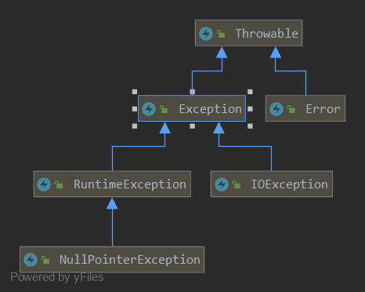

# 第十六章 异常机制和file类

## 16.1 异常机制（重点）

### 16.1.1 基本概念

- 所谓的异常就是Java程序在运行过程中发生了错误，出现了不正常的行为，中断正在执行程序的正常指令流；

- Java.lang.Throwable类是Java中Error和Exception的基类；

- Error称为错误，主要是一些JVM层面的错误，程序开发人员是无法通过程序去处理的，只能重启JVM。例如堆栈溢出。

- Exception称为异常，主要是一些程序设计不严谨所抛出一些异常情况，开发人员可以事先通过编码去捕获处理。例如典型的空指针异常（NullPointException）。


### 16.1.2 异常的分类

- Throwable类URL图



上图所示

异常的分类主要分类两种：

- RuntimeException  非检测性异常

- IOException和其他异常  检测性异常

**判断检测性异常和非检测性异常的区别：非检测性异常编译器无法识别，只有在程序运行的过程中才会发现；检测性
异常是编译器能够发现的**

- 代码demo

```java
System.out.println("-----------非检测性异常----------");
/**
 * 此时编译器并没有提示报错，运行时会抛出Exception in thread "main" java.lang.ArithmeticException: / by zero
 */
System.out.println(4 / 0);

System.out.println("-----------检测性异常------------");
/**
 * 会有红色波浪线提示unhandledException，此时需要捕获处理
 */
try {
    Thread.sleep(1000);
} catch (InterruptedException e) {
    e.printStackTrace();
}
```

- 注意

一旦程序抛出异常，抛出异常地方下面的程序都不会再执行。

### 16.1.3 异常避免

- 通常程序开发使用if判断语句进行避免异常的发生

- 缺点：代码可读性差，臃肿

- 代码demo

```java
System.out.println("-------------算术异常------------");
int a = 8;
int b = 0;
if (0 != b) {
    System.out.println(a / b);
}

System.out.println("------------下标越界异常--------");
int[] arr = new int[5];
int index = 5;
if (arr.length > 0 && arr.length < 5) {
    System.out.println(arr);
}

System.out.println("-------------空指针异常----------");
String str = null;
if (null != str) {
    System.out.println(str.length());
}

System.out.println("------------类型转换异常---------");
Object it = new Object();
if(it instanceof String) {
    String c = (String) it;
}

System.out.println("------------数据格式异常---------");
String numStr = "123r";
if (numStr.matches("\\d+")) {
    int i = Integer.parseInt(numStr);
    System.out.println(i);
}
```

### 16.1.6 自定义异常

- 自定义异常类

```java
public class AgeException extends Exception{

    /**
     * 自定义异常AgeException，用于判断用户年龄是否符合要求
     */
    public AgeException() {
        super();
    }

    public AgeException(String message) {
        super(message);
    }
}
```

- 学生类

```java
private String name;

private int age;

public String getName() {
    return name;
}

public void setName(String name) {
    this.name = name;
}

public int getAge() {
    return age;
}


/**
 * 使用throw进行声明异常
 *
 * @param age
 * @throws AgeException
 */
public void setAge(int age) throws AgeException {
    if (age > 0 && age < 120) {
        this.age = age;
    } else {
        throw new AgeException("年龄不合理");
    }

}

public Student(String name, int age) throws AgeException {
    setName(name);
    setAge(age);
}


@Override
public String toString() {
    return "Student{" +
            "name='" + name + '\'' +
            ", age=" + age +
            '}';
}
```

- 测试结果类

```java
/**
 * 1. 当使用throw的方式进行将一场进行跑出去的时候，由调用者进行try-catch进行捕获进行处理的时候，一旦发生异常就不会生成对象
 *
 * 打印结果：
 *
 * student1 = Student{name='fuyi', age=10}
 * com.ryan.stage1.model4.task16.AgeException: 年龄不合理
 * 	at com.ryan.stage1.model4.task16.Student.setAge(Student.java:32)
 * 	at com.ryan.stage1.model4.task16.Student.<init>(Student.java:39)
 * 	at com.ryan.stage1.model4.task16.StudentTest.main(StudentTest.java:13)
 */
try {
    Student student1 = new Student("fuyi", 10);
    System.out.println("student1 = " + student1);
    Student student2 = new Student("Sam", 130);
    System.out.println("student2  =" + student2);
} catch (AgeException e) {
    e.printStackTrace();
}
```

- 使用try-catch方式

```java
private String name;

private int age;

public String getName() {
    return name;
}

public void setName(String name) {
    this.name = name;
}

public int getAge() {
    return age;
}


/**
 * 使用throw进行声明异常
 *
 * @param age
 * @throws AgeException
 */
public void setAge(int age) throws AgeException {
    if (age > 0 && age < 120) {
        this.age = age;
    } else {
        throw new AgeException("年龄不合理");
    }

}


public Student(String name, int age) {
    setName(name);
    try {
        setAge(age);
    } catch (AgeException e) {
        e.printStackTrace();
    }
}

@Override
public String toString() {
    return "Student{" +
            "name='" + name + '\'' +
            ", age=" + age +
            '}';
    }
```

- 测试结果

```java
/**
 * 2. 如果在方法本身内部使用try-catch进行捕获处理，对象还是会生成
 *
 * 打印结果：
 * com.ryan.stage1.model4.task16.AgeException: 年龄不合理
 * 	at com.ryan.stage1.model4.task16.Student.setAge(Student.java:32)
 * 	at com.ryan.stage1.model4.task16.Student.<init>(Student.java:45)
 * 	at com.ryan.stage1.model4.task16.StudentTest.main(StudentTest.java:22)
 * student3 = Student{name='Lucy', age=0}
 */
Student student3 = new Student("Lucy", 123);
System.out.println("student3 = " + student3);
```

- 总结

**使用throw和try-catch的区别：** 在于try-catch还是可以进行对象的生成，而使用throw进行抛出异常的时候，此时对象不会生成而为null。

## 16.2 File类

### 16.2.1 基本概念
java.io.File类主要用于描述文件或目录路径的抽象表示信息，可以获取文件或目录的特征信息，
如：大小等。

### 16.2.2 常用的方法
|方法声明 | 功能概述|
|:------ | :------|
|File(String pathname) | 根据参数指定的路径名来构造对象|
|File(String parent, String child) | 根据参数指定的父路径和子路径信息构造对象|
|File(File parent, String child) | 根据参数指定的父抽象路径和子路径信息构造对象|
|boolean exists() | 测试此抽象路径名表示的文件或目录是否存在|
|String getName() | 用于获取文件的名称|
|long length() | 返回由此抽象路径名表示的文件的长度|
|long lastModified() | 用于获取文件的最后一次修改时间|
|String getAbsolutePath() | 用于获取绝对路径信息|
|boolean delete() | 用于删除文件，当删除目录时要求是空目录|
|boolean createNewFile() | 用于创建新的空文件|
|boolean mkdir() | 用于创建目录|
|boolean mkdirs() | 用于创建多级目录|
|File[] listFiles() | 获取该目录下的所有内容|
|boolean isFile() | 判断是否为文件|
|boolean isDirectory() | 判断是否为目录|
|File[] listFiles(FileFilter filter) | 获取目录下满足筛选器的所有内容|


