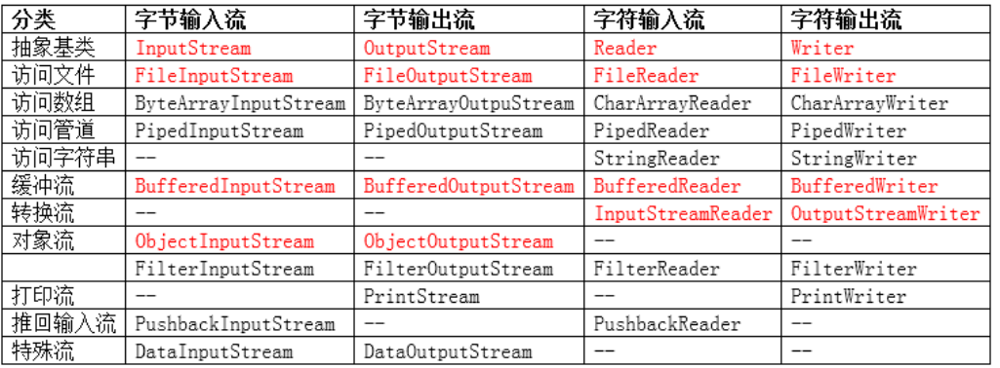
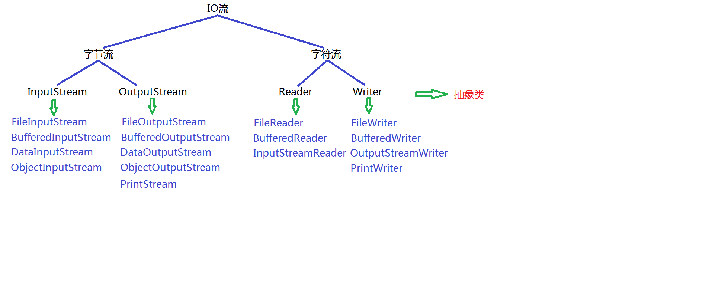

# 第十七章 IO流

## 17.1 IO流的概念

- IO就是Input和Output的简写。

- IO流就是是Java程序读写数据的一种方式。流是一种有序的数据序列，将数据从一个地方带到另一个地方。

## 17.2 基本分类

- 按流的方向

  - 输出流，从程序到文件、网络、数据库和其他数据源
  
  - 输入流，从文件、网络、数据库和其他数据源到程序
  
  - 如下图所示
  
- 按流的数据单位

  - 字节流，以字节（8位）为单位进行数据的读写，可以读写任意类型的文件。
    
  - 字符流，以字符（2个字节）为单位进行数据的读写，只能读取文本文件。

- 按流的功能

  - 节点流，就是指直接和输入输出源对接的流。
  
  - 处理流，指建立在在节点流的基础上的流。
  
## 17.3 体系结构



## 17.4 相关流的详解

- 流体系框架图



### 17.4.1 FileWriter类（重点）

- 作用

**java.lang.FileWriter类主要用于将文本内容写入到文本文件**

- 常用构造方法

|  方法声明   | 功能  |
|  ----  | ----  |
| FileWriter​(File file)  | 使用平台的默认字符集构造给定要写入文件的FileWriter |
| FileWriter​(File file, boolean append)  | 使用平台的默认字符集，构造一个FileWriter，给定要写入的File和一个布尔值，该布尔值指示是否追加写入的数据。 |
| FileWriter​(File file, Charset charset)  | 给定File来构造FileWriter进行写和字符集设置。 |

代码demo

```java
FileWriter fileWriter1 = null;
FileWriter fileWriter2 = null;
try {
    //1. 构造方法一
    fileWriter1 = new FileWriter("U:\\Ryan\\lagou-basic\\stage1\\src\\main\\java\\com\\ryan\\stage1\\model4\\task17\\file");

    //2. 构造方法二(内容追加方式)
    fileWriter2 = new FileWriter("U:\\Ryan\\lagou-basic\\stage1\\src\\main\\java\\com\\ryan\\stage1\\model4\\task17\\file", true);
} catch (IOException e) {
    e.printStackTrace();
} finally {
    if (fileWriter1 != null || fileWriter2 != null) {
        //关闭资源
        try {
            fileWriter1.close();
            fileWriter2.close();
        } catch (IOException e) {
            e.printStackTrace();
        }
    }
}
```

- 常用方法

代码demo

```java
System.out.println("--------------------------FileWriter类常用方法--------------------------------------");

/**
 *  1. 写入单个字符，
 */
fileWriter1.write("B");                      // B

/**
 * 2. 将指定字符数组中从偏移量off开始的len个字符写入此文件输出流
 */
char[] cArr = new char[]{'a', 'b', 'c', 'd'};
fileWriter1.write(cArr, 1, 3);        // bcd

/**
 * 3. 将cbuf.length个字符从指定字符数组写入此文件输出流中
 */
fileWriter1.write(cArr);                      // bcdabcd

/**
 * 4. 刷新流
 */
fileWriter1.flush();

/**
 * 5. 关闭流对象释放有关的资源
 */
fileWriter1.close();
```

### 17.4.2 FileReader类（重点）

- 作用

**java.lang.FileReader类主要用于从文本文件读取文本数据内容**

- 常用构造方法

代码demo

```java
System.out.println("-------------构造方法-----------------");
//1. 构造方法一
FileReader fileReader1 = null;

try {
    fileReader1 = new FileReader("U:/Ryan/lagou-basic/stage1//src/main/java/com/ryan/stage1/model4/task17/file/myFile.txt");
} catch (FileNotFoundException e) {
    e.printStackTrace();
} finally {
    if (fileReader1 != null) {
        try {
            fileReader1.close();
        } catch (IOException e) {
            e.printStackTrace();
        }
    }
}
```

- 常用类方法

代码demo

```java
System.out.println("----------------常用方法-------------------------");

/**
 * 1. 读取单个字符的数据并返回，返回-1表示读取到末尾
 */
int read = fileReader1.read();
System.out.println((char) read);               // B

/**
 * 2. 读取全部
 */
while (fileReader1.read() != -1) {
    int read1 = fileReader1.read();
    System.out.println("字符为：" + (char) read1);
}

/**
 * 3. 从输入流中将最多len个字符的数据读入一个字符数组中，返回读取到的字符个数，返回-1表示读取到末尾
 */
char[] cArr = new char[5];
fileReader1.read(cArr, 0, 5);
System.out.println(cArr);                      // Bbcda

 /** 4. 关闭流对象，释放资源
  */
fileReader1.close();
```

### 17.4.3 FileOutputStream类（重点）

**上述的两个类主要对文件进行读写操作，但是对于音频和视频是不能进行读写，就算读写成功也是解析不出来，因此下面介绍能够读取任意文件类型的
文件流类**

- 作用

**java.io.FileOutputStream类主要用于将图像数据之类的原始字节流写入到输出流中。**

- 构造方法

代码demo

```java
System.out.println("-------------------构造方法-----------------------");

FileOutputStream fileOutputStream1 = null;
FileOutputStream fileOutputStream2 = null;

/**
 * 创建文件输出流以写入具有指定名称的文件
 */
try {
    //1. 构造一 (如果文件不存在会自动创建一个空白文件)
    fileOutputStream1 = new FileOutputStream("e:/myFile.txt");

    //2. 构造二 （进行追加内容）
    fileOutputStream2 = new FileOutputStream("e:/myFile.txt",true);
} catch (FileNotFoundException e) {
    e.printStackTrace();
} finally {
    if (null != fileOutputStream1) {
        try {
            fileOutputStream1.close();
        } catch (IOException e) {
            e.printStackTrace();
        }
    }
    if (null != fileOutputStream2) {
        try {
            fileOutputStream2.close();
        } catch (IOException e) {
            e.printStackTrace();
        }
    }
}
```

- 常用方法

```java
System.out.println("-------------------构造方法-----------------------");

FileOutputStream fileOutputStream1 = null;
FileOutputStream fileOutputStream2 = null;

/**
 * 创建文件输出流以写入具有指定名称的文件
 */
try {
    //1. 构造一 (如果文件不存在会自动创建一个空白文件)
    fileOutputStream1 = new FileOutputStream("e:/myFile.txt");

    //2. 构造二 （进行追加内容）
    fileOutputStream2 = new FileOutputStream("e:/myFile.txt",true);

    System.out.println("--------------------常用方法----------------------");

    /**
     * 1. 将指定字节写入此文件输出流
     */
    fileOutputStream1.write('G');

    /**
     * 2. 将指定字节数组中从偏移量off开始的len个字节写入此文件输出流
     */
    byte[] arr = new byte[] {65, 66, 67, 68};
    fileOutputStream1.write(arr);

    /**
     * 3. 刷新此输出流并强制写出任何缓冲的输出字节
     */
    fileOutputStream1.flush();

} catch (FileNotFoundException e) {
    e.printStackTrace();
} catch (IOException e) {
    e.printStackTrace();
} finally {
    if (null != fileOutputStream1) {
        try {
            /**
             * 4. 关闭流对象并释放有关的资源
             */
            fileOutputStream1.close();
        } catch (IOException e) {
            e.printStackTrace();
        }
    }
    if (null != fileOutputStream2) {
        try {
            fileOutputStream2.close();
        } catch (IOException e) {
            e.printStackTrace();
        }
    }
}
```

- 总结

### 17.4.4 FileInputStream类（重点）

- 作用

**java.io.FileInputStream类主要用于从输入流中以字节流的方式读取图像数据等。**

- 构造方法

代码demo

```java
System.out.println("-----------------构造方法------------------------");
        FileInputStream fileInputStream1 = null;

        try {
            fileInputStream1= new FileInputStream("e:/myFile.txt");
        } catch (FileNotFoundException e) {
            e.printStackTrace();
        } finally {
            if (null != fileInputStream1) {
                try {
                    /**
                     * 4. 关闭流对象并释放有关的资源
                     */
                    fileInputStream1.close();
                } catch (IOException e) {
                    e.printStackTrace();
                }
            }
        }
```

- 常用方法

```java
System.out.println("-----------------构造方法------------------------");
FileInputStream fileInputStream1 = null;

try {
    fileInputStream1= new FileInputStream("e:/myFile.txt");

    System.out.println("----------------常用方法----------------------");

    /**
     * 1. 从输入流中读取单个字节的数据并返回，返回-1表示读取到末尾
     * 注意：这里调用read()方法和迭代器itertor.next()方法是一样，每调用一次，游标向下移动一次
     */
    int read = fileInputStream1.read();
    System.out.println((char) read);

    while ((read = fileInputStream1.read()) != -1) {
        System.out.println((char) read);                              // A B C D
    }

    while (fileInputStream1.read() != -1) {
        System.out.println((char) fileInputStream1.read());           // B D
    }

    /**
     * 2. 从此输入流中将最多 b.length 个字节的数据读入字节数组中，返回读取到的字节个数，返回-1表示读取到末尾
     */
    byte[] brr = new byte[5];
    fileInputStream1.read(brr);
    for (byte b : brr) {
        System.out.print(b);                                         // 71 65 66 67 68
    }

    /**
     * 3. 获取输入流所关联文件的大小
     */
    System.out.println("输入流大小为：" + fileInputStream1.available());// 5
} catch (FileNotFoundException e) {
    e.printStackTrace();
} catch (IOException e) {
    e.printStackTrace();
} finally {
    if (null != fileInputStream1) {
        try {
            /**
             * 4. 关闭流对象并释放有关的资源
             */
            fileInputStream1.close();
        } catch (IOException e) {
            e.printStackTrace();
        }
    }
}
```

- 文件拷贝

```java
//测试拷贝效率
long start = System.currentTimeMillis();
FileInputStream fileInputStream = null;
FileOutputStream fileOutputStream = null;

try {
    //1. 创建文件输入流
    fileInputStream = new FileInputStream("e:/myFile.txt");

    //2. 创建文件输出流
    fileOutputStream = new FileOutputStream("e:/myFileCopys.txt");

    //3. 读取一个字节然后写入一个字节
    int read = 0;
    while ((read = fileInputStream.read()) != -1) {
        fileOutputStream.write(read);
    }

    //4. 使用缓存分多少次进行读写
    byte[] brr = new byte[1024];
    int length = 0;
    while ((length = fileInputStream.read(brr)) != -1) {
        fileOutputStream.write(brr, 0, length);
    }
} catch (IOException e) {
    e.printStackTrace();
} finally {
    //关闭资源
    if (null != fileInputStream)  {
        try {
            fileInputStream.close();
        } catch (IOException e) {
            e.printStackTrace();
        }
    }
    if (null != fileOutputStream)  {
        try {
            fileOutputStream.close();
        } catch (IOException e) {
            e.printStackTrace();
        }
    }
}
long end = System.currentTimeMillis();
System.out.println("Copy消耗时间" + (end - start) + "ms");          //9ms
System.out.println("缓存方式Copy消耗时间" + (end - start) + "ms");   //1ms
```

- 总结

  - 这里调用read()方法和迭代器itertor.next()方法是一样，每调用一次，游标向下移动一次；读取完后想要重新再读取一遍需要重新创建一个流对象

  - 通过上面两个类可以实现文件的拷贝，拷贝的方式有三种：第一种是逐个字节读取并写入，缺点就是文件过大时候，花费时间很长；
  第二种是通过将文件读入到一个文件大小的字节数组缓冲区里面，读取完毕再一并写入，缺点就是文件过大占用较大的物理内存空间；
  第三种是在第二种的基础上通过分批多次读取并写入，相对前面两种来说效率得到提升和资源开销也减少了。

### 17.4.5 BufferedOutputStream类（重点）

**上面章节结束的时候，我们使用自定义缓存的方式进行读写copy文件，Java官方也提供了这种缓存式的读写操作的类。本章节就继续讨论缓存式读写操作类**
- 作用

**java.io.BufferedOutputStream类主要用于描述缓冲输出流，此时不用为写入的每个字节调用底层系统。**

- 构造方法

代码demo

```java
BufferedOutputStream bos = null;

System.out.println("---------------------构造方法---------------------------");
try {
    // 1.创建BufferedOutputStream类型的对象与e:/myFile.txt流的框架结构.txt文件关联
    bos = new BufferedOutputStream(new FileOutputStream("e:/myFile.txt"));
} catch (IOException e) {
    e.printStackTrace();
} finally {
    // 4.关闭流对象并释放有关的资源
    if (null != bos) {
        try {
            bos.close();
        } catch (IOException e) {
            e.printStackTrace();
        }
    }
}
```

- 常用方法

```java
BufferedOutputStream bos = null;

System.out.println("---------------------构造方法---------------------------");
try {
    // 1.创建BufferedOutputStream类型的对象与e:/myFile.txt流的框架结构.txt文件关联
    bos = new BufferedOutputStream(new FileOutputStream("e:/myFile.txt"));

    System.out.println("--------------------常用方法----------------------");

    /**
     * 1. 将指定字节写入此文件输出流
     */
    bos.write('G');

    /**
     * 2. 将指定字节数组中从偏移量off开始的len个字节写入此文件输出流
     */
    byte[] arr = new byte[] {65, 66, 67, 68};
    bos.write(arr);

    /**
     * 3. 刷新此输出流并强制写出任何缓冲的输出字节
     */
    bos.flush();

} catch (IOException e) {
    e.printStackTrace();
} finally {
    // 4.关闭流对象并释放有关的资源
    if (null != bos) {
        try {
            bos.close();
        } catch (IOException e) {
            e.printStackTrace();
        }
    }
}
```

- 总结

  和上面的的流对象相比，只是构造方法的不同，其他的常用方法都是一样，后就不再加以赘述了。

### 17.4.6 BufferedInputStream类（重点）

- 作用

**java.io.BufferedInputStream类主要用于描述缓冲输入流。**

- 构造方法

代码demo

```java
BufferedInputStream bis = null;

System.out.println("-------------------构造方法-------------------");

try {
    new BufferedInputStream(new FileInputStream("e:/myFile.txt"));
} catch (FileNotFoundException e) {
    e.printStackTrace();
} finally {
    if (null != bis) {
        try {
            bis.close();
        } catch (IOException e) {
            e.printStackTrace();
        }
    }
}
```

- 常用方法

```java
参考FileInputStream
```

- 文件拷贝

```java
// 获取当前系统时间距离1970年1月1日0时0分0秒的毫秒数
long g1 = System.currentTimeMillis();

BufferedInputStream bis = null;
BufferedOutputStream bos = null;

try {
    // 1.创建BufferedInputStream类型的对象与e:/myFile.txt文件关联
    bis = new BufferedInputStream(new FileInputStream("e:/myFile.txt"));
    // 2.创建BufferedOuputStream类型的对象与e:/myFileCopys.txt文件关联
    bos = new BufferedOutputStream(new FileOutputStream("e:/myFileCopys.txt"));

    // 3.不断地从输入流中读取数据并写入到输出流中

    byte[] bArr = new byte[1024];
    int res = 0;
    while ((res = bis.read(bArr)) != -1) {
        bos.write(bArr, 0, res);
    }

} catch (IOException e) {
    e.printStackTrace();
} finally {
    // 4.关闭流对象并释放有关的资源
    if (null != bos) {
        try {
            bos.close();
        } catch (IOException e) {
            e.printStackTrace();
        }
    }
    if (null != bis) {
        try {
            bis.close();
        } catch (IOException e) {
            e.printStackTrace();
        }
    }
}

long g2 = System.currentTimeMillis();
System.out.println("使用缓冲区拷贝文件消耗的时间为：" + (g2-g1)); // 1ms
```


### 17.4.7 BufferedWrite类（重点）

- 作用

**java.io.BufferedWriter类主要用于写入单个字符、字符数组以及字符串到输出流中。**

- 构造方法

代码demo

```java
System.out.println("-----------构造方法--------------");

BufferedWriter bufferedWriter1 = null;

try {
    bufferedWriter1 = new BufferedWriter(new FileWriter("e:/myFile.txt"));
} catch (IOException e) {
    e.printStackTrace();
} finally {
    if (null != bufferedWriter1) {
        try {
            /**
             * 6. 关闭资源
             */
            bufferedWriter1.close();
        } catch (IOException e) {
            e.printStackTrace();
        }
    }

}
```

- 常用方法

```java
System.out.println("-----------构造方法--------------");

BufferedWriter bufferedWriter1 = null;

try {
    bufferedWriter1 = new BufferedWriter(new FileWriter("e:/myFile.txt"));

    System.out.println("-------常用方法--------------");

    /**
     * 1. 写入单个字符到输出流中
     */
    bufferedWriter1.write(70);

    /**
     * 2. 将字符串数组cbuf中所有内容写入输出流中
     */
    char[] cArr = new char[] {'b', 'n', 'y'};
    bufferedWriter1.write(cArr);

    /**
     * 3. 将参数指定的字符串内容写入输出流中
     */
    bufferedWriter1.write("fuyi");

    /**
     * 4. 用于写入行分隔符到输出流中
     */
    bufferedWriter1.newLine();

    bufferedWriter1.write(cArr);

    /**
     * 5. 刷新流
     */
    bufferedWriter1.flush();


} catch (IOException e) {
    e.printStackTrace();
} finally {
    if (null != bufferedWriter1) {
        try {
            /**
             * 6. 关闭资源
             */
            bufferedWriter1.close();
        } catch (IOException e) {
            e.printStackTrace();
        }
    }

}
```

- 总结

### 17.4.8 BufferedRead类（重点）

- 作用

**java.io.BufferedReader类用于从输入流中读取单个字符、字符数组以及字符串。**

- 构造方法

代码demo

```java
System.out.println("--------------构造方法------------------");

BufferedReader bufferedReader1 = null;

try {
    bufferedReader1 = new BufferedReader(new FileReader("e:/myFile.txt"));
    
} catch (FileNotFoundException e) {
    e.printStackTrace();
} finally {
    if (null != bufferedReader1) {
        try {
            bufferedReader1.close();
        } catch (IOException e) {
            e.printStackTrace();
        }
    }
}
```

- 常用方法

```java
BufferedReader bufferedReader1 = null;

try {
    bufferedReader1 = new BufferedReader(new FileReader("e:/myFile.txt"));

    System.out.println("-----------------常用方法---------------");

    /**
     * 1. 从输入流读取单个字符，读取到末尾则返回-1，否则返回实际读取到的字符内容
     */
    int read = bufferedReader1.read();
    System.out.println((char) read);

    /**
     * 2. 从输入流中读满整个数组cbuf
     */
    char[] crr = new char[5];
    bufferedReader1.read(crr);
    System.out.println(crr);

    /**
     * 3. 读取一行字符串并返回，返回null表示读取到末尾
     */
    String str = null;
    while ((str = bufferedReader1.readLine()) != null) {
        System.out.println(str);
    }

} catch (FileNotFoundException e) {
    e.printStackTrace();
} catch (IOException e) {
    e.printStackTrace();
} finally {
    if (null != bufferedReader1) {
        try {
            /**
             * 4. 关闭资源
             */
            bufferedReader1.close();
        } catch (IOException e) {
            e.printStackTrace();
        }
    }
}
```

- 总结

### 17.4.9 PrintStream类（重点）

- 作用

**java.io.PrintStream类主要用于更加方便地打印各种数据内容。**

- 构造方法

代码demo

```java
System.out.println("---------------构造方法------------------");

PrintStream printStream1 = null;

try {
    printStream1 = new PrintStream(new FileOutputStream("e:/myFile.txt"));
} catch (FileNotFoundException e) {
    e.printStackTrace();
} finally {
    if (null != printStream1) {
        printStream1.close();
    }
}
```

- 常用方法

```java
PrintStream printStream1 = null;

try {
    printStream1 = new PrintStream(new FileOutputStream("e:/myFile.txt"));

    System.out.println("-----------------常用方法-------------------");

    /**
     * 1. 用于将参数指定的字符串内容打印出来
     */
    printStream1.print("fuyinb");

    /**
     * 2. 用于打印字符串后并终止该行
     */
    printStream1.println("cheshigailei");
    printStream1.println("另起一行");

    /**
     * 3. 刷新流
     */
    printStream1.flush();
} catch (FileNotFoundException e) {
    e.printStackTrace();
} finally {
    if (null != printStream1) {
        /**
         * 4. 关闭流
         */
        printStream1.close();
    }
}
```

- 总结

### 17.4.10 PrintWriter类

- 作用

**java.io.PrintWriter类主要用于将对象的格式化形式打印到文本输出流。**

- 构造方法

代码demo

```java
System.out.println("-------------------构造方法-------------------");

PrintWriter printWriter1 = null;

try {
    printWriter1 = new PrintWriter(new FileWriter("e:/myChat.txt"));
} catch (IOException e) {
    e.printStackTrace();
} finally {
    if (null != printWriter1) {
        printWriter1.close();
    }
}
```

- 常用方法

```java
参考PrintWriter类
```

- 总结

### 17.4.11 OutputStreamWriter类（重点）

- 作用

**java.io.OutputStreamWriter类主要用于实现从字符流到字节流的转换。**

- 构造方法

代码demo

```java
OutputStreamWriter outputStreamWriter1 = null;
OutputStreamWriter outputStreamWriter2 = null;

try {

    //构造方法一
    outputStreamWriter1 = new OutputStreamWriter(new FileOutputStream("e:/myFile.txt"));

    //构造方法二
    outputStreamWriter2 = new OutputStreamWriter(new FileOutputStream("e:/myFile.txt"), "utf-8");
   
} catch (FileNotFoundException e) {
    e.printStackTrace();
} catch (UnsupportedEncodingException e) {
    e.printStackTrace();
} catch (IOException e) {
    e.printStackTrace();
} finally {
    if (null != outputStreamWriter1) {
        try {
            /**
             * 3. 关闭流
             */
            outputStreamWriter1.close();
        } catch (IOException e) {
            e.printStackTrace();
        }
    }
    if (null != outputStreamWriter2) {
        try {
            outputStreamWriter2.close();
        } catch (IOException e) {
            e.printStackTrace();
        }
    }
}
```

- 常用方法

```java

System.out.println("------------------常用方法-------------------");

/**
 * 1. 将参数指定的字符串写入
 */
outputStreamWriter1.write(68);
outputStreamWriter1.write("jshgh");
outputStreamWriter1.write('j');

/**
 * 2. 刷新流
 */
outputStreamWriter1.flush();

/**
 * 3. 关闭流
 */
outputStreamWriter1.close();
```

- 总结

### 17.4.12 InputStreamReader类（重点）

- 作用

**java.io.InputStreamReader类主要用于实现从字节流到字符流的转换。**

- 常用方法

| 方法声明 | 功能介绍 |
| :------- | :------- |
| InputStreamReader(InputStream in) | 根据参数指定的引用来构造对象 |
| InputStreamReader(InputStream in, String charsetName) | 根据参数指定的引用和编码来构造对象 |
| int read(char[] cbuf) | 读取字符数据到参数指定的数组 |
|void close() | 用于关闭输出流并释放有关的资源|


### 17.4.13 字符编码

- 背景

  - 计算机只能识别二进制数据，早期就是电信号。为了方便计算机可以识别各个国家的文字，就需要
    将各个国家的文字采用数字编号的方式进行描述并建立对应的关系表，该表就叫做编码表。

- 常见编码

  - GBK 
  
  - UTF-8
  
  - ASCII

- 发展

### 17.4.14 DataOutputStream类（了解）

- 作用

**java.io.DataOutputStream类主要用于以适当的方式将基本数据类型写入输出流中。**

- 常用方法

代码demo

```java
DataOutputStream dataOutputStream = null;

try {
    dataOutputStream = new DataOutputStream(new FileOutputStream("e:/myFile.txt"));

    System.out.println("-------------------常用方法---------------------");

    /**
     * 1. 用于将参数指定的整数一次性写入输出流，优先写入高字节
     */
    dataOutputStream.writeInt(67);             //   C
} catch (FileNotFoundException e) {
    e.printStackTrace();
} catch (IOException e) {
    e.printStackTrace();
} finally {
    if (null != dataOutputStream) {
        try {
            dataOutputStream.close();
        } catch (IOException e) {
            e.printStackTrace();
        }
    }
}
```

### 17.4.14 DataInputStream类（了解）

- 作用

**java.io.DataInputStream类主要用于以适当的方式从输入流中读取基本数据类型的数据。**

- 常用方法

```java
DataInputStream dis = null;

try {
    // 1.创建DataInputStream类型的对象与d:/a.txt文件关联
    dis = new DataInputStream(new FileInputStream("e:/myFile.txt"));
    // 2.从输入流中读取一个整数并打印
    int res = dis.readInt(); // 读取4个字节
    //int res = dis.read();      // 读取1个字节
    System.out.println("读取到的整数数据是：" + res); // 67
} catch (IOException e) {
    e.printStackTrace();
} finally {
    // 3.关闭流对象并释放有关的资源
    if (null != dis) {
        try {
            dis.close();
        } catch (IOException e) {
            e.printStackTrace();
        }
    }
}
```

### 17.4.15 序列化与反序列化

- 基本概念

  - 序列化   （对象 -> 字节流）
  
  - 反序列化 （字节流 -> 对象）

- 序列化版本号

  在 序列化存储/反序列化读取 或者是 序列化传输/反序列化接收 时，JVM 会把传来的字节流中的serialVersionUID与本地相应实体（类）的serialVersionUID进行比较，如果相同就认为是一致的，可以进行反序列化，否则就会出现序列化版本不一致的异常。
 
- transient关键字

  在Java中，当一个类实现了java.io.Serializable接口，即表明了该类可以被序列化。我们可以把该类的属性序列化然后保存在外部，或者跟另外一个jvm进行数据传递。但是，我们是否想过，如果一个类包含隐私信息，如用户的密码等，那么这个属性就不能够被序列化到外部。当然，我们可以在序列化之前手动set该值为null，但是最优雅的做法就是使用transient关键字。
 
### 17.4.16 ObjectOutputStream类（重点）

- 作用
  
  - java.io.ObjectOutputStream类主要用于将一个对象的所有内容整体写入到输出流中。

  - 只能将支持 java.io.Serializable 接口的对象写入流中。
  
  - 类通过实现 java.io.Serializable 接口以启用其序列化功能。

  - 所谓序列化主要指将一个对象需要存储的相关信息有效组织成字节序列的转化过程。
  
- 常用方法

```java
ObjectOutputStream oos = null;

try {
    // 1.创建ObjectOutputStream类型的对象与d:/a.txt文件关联
    oos = new ObjectOutputStream(new FileOutputStream("e:/myFile.txt"));
    // 2.准备一个Student类型的对象并初始化
    Student student = new Student("fuyi", "123456");
    // 3.将整个Student类型的对象写入输出流
    oos.writeObject(student);
    System.out.println("写入对象成功！");
} catch (IOException e) {
    e.printStackTrace();
} finally {
    // 4.关闭流对象并释放有关的资源
    if (null != oos) {
        try {
            oos.close();
        } catch (IOException e) {
            e.printStackTrace();
        }
    }
}
```

### 17.4.17 ObjectInputStream类（重点）

- 作用
  
  **java.io.ObjectInputStream类主要用于从输入流中一次性将对象整体读取出来。**
  
- 常用方法

```java
ObjectInputStream ois = null;

try {
    // 1.创建ObjectInputStream类型的对象与d:/a.txt文件关联
    ois = new ObjectInputStream(new FileInputStream("e:/myFile.txt"));
    // 2.从输入流中读取一个对象并打印
    Object obj = ois.readObject();
    System.out.println("读取到的对象是：" + obj); // fuyi 123456
} catch (IOException e) {
    e.printStackTrace();
} catch (ClassNotFoundException e) {
    e.printStackTrace();
} finally {
    // 3.关闭流对象并释放有关的资源
    if (null != ois) {
        try {
            ois.close();
        } catch (IOException e) {
            e.printStackTrace();
        }
    }
}
```

- 编程开发经验

  当希望将多个对象写入文件时，通常建议将多个对象放入一个集合中，然后将集合这个整体看做一
  个对象写入输出流中，此时只需要调用一次readObject方法就可以将整个集合的数据读取出来，
  从而避免了通过返回值进行是否达到文件末尾的判断。

### 17.4.18 RandomAccessFile类

- 作用
  
  **java.io.RandomAccessFile类主要支持对随机访问文件的读写操作。**
  
- 常用方法

| 方法声明 | 功能介绍 |
| :------ | :------ |
| RandomAccessFile(String name, String mode) | 根据参数指定的名称和模式构造对象 r: 以只读方式打开 rw：打开以便读取和写入 rwd:打开以便读取和写入，同步文件内容的更新 rws:打开以便读取和写入，同步文件内容和元数据的更新 |
| int read() | 读取单个字节的数据 |
| void seek(long pos) | 用于设置从此文件的开头开始测量的文件指针偏移量 |
|void write(int b) | 将参数指定的单个字节写入 |
|void close() | 用于关闭流并释放有关的资源|

- 代码demo

```java
RandomAccessFile raf = null;

try {
    // 1.创建RandomAccessFile类型的对象与d:/a.txt文件关联
    raf = new RandomAccessFile("e:/myFile.txt", "rw");
    // 2.对文件内容进行随机读写操作
    // 设置距离文件开头位置的偏移量，从文件开头位置向后偏移3个字节    aellhello
    raf.seek(3);
    int res = raf.read();
    System.out.println("读取到的单个字符是：" + (char)res); // a l
    res = raf.read();
    System.out.println("读取到的单个字符是：" + (char)res); // h 指向了e
    raf.write('2'); // 执行该行代码后覆盖了字符'e'
    System.out.println("写入数据成功！");
      
} catch (IOException e) {
    e.printStackTrace();
} finally {
    // 3.关闭流对象并释放有关的资源
    if (null != raf) {
        try {
            raf.close();
        } catch (IOException e) {
            e.printStackTrace();
        }
    }
}
```


