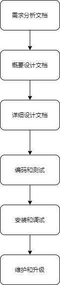

# 第二十一章 常用设计原则和设计模式

## 21.1 常用的设计原则（熟悉）

### 21.1.1 软件的开发流程

### 21.1.2 常用的设计模式

- 开闭原则
  
  对扩展开发，修改关闭，提高程序扩展性、维护性和升级
  
- 里氏代换原则（Liskov Substitution Principle）
  任何基类可以出现的地方，子类一定可以出现，多使用多态的方式。
  
- 依赖倒转原则（Dependence Inversion Principle）
  尽量多依赖于抽象类或接口而不是具体实现类，对子类具有强制性和规范性
  
- 接口隔离原则（Interface Segregation Principle）
  尽量多使用小接口而不是大接口，避免接口的污染，降低类之间耦合度。

- 迪米特法则（最少知道原则）（Demeter Principle）
  一个实体应当尽量少与其他实体之间发生相互作用，使系统功能模块相对独立。
  高内聚，低耦合。

- 合成复用原则（Composite Reuse Principle）
  尽量多使用合成/聚合的方式，而不是继承的方式。
  
## 21.2 常用的设计模式
### 21.2.1 基本概念
设计模式（Design pattern）是一套被反复使用、多数人知晓的、经过分类编目的、代码设计经验的总结。设计模式就是一种用于固定场合的固定套路。
  
### 21.2.2 基本分类

- 创建型模式 - 单例设计模式、工厂方法模式、抽象工厂模式、...

- 结构型模式 - 装饰器模式、代理模式、...

- 行为型模式 - 模板设计模式、...
  
## 21.3 设计模式详解（重点）
### 21.3.1 单例设计模式
单例设计模式主要分为：饿汉式 和 懒汉式，懒汉式需要对多线程进行同步处理。
  
### 21.3.2 普通工厂模式
（1）基本概念
  
  普通工厂方法模式就是建立一个工厂类，对实现了同一接口的不同实现类进行实例的创建。
 
（2）主要缺点
  
  在普通工厂方法模式中，如果传递的字符串出错，则不能正确创建对象，并且可能出现空指针异常。
  
### 21.3.3 多个工厂方法模式
 （1）主要缺点
 
  在多个工厂方法模式中，为了能够正确创建对象，先需要创建工厂类的对象才能调用工厂类中的生产方法。

### 21.3.4 静态工厂方法模式
  （1）实际意义
  
  工厂方法模式适合：凡是出现了大量的产品需要创建且具有共同的接口时，可以通过工厂方法模式
  进行创建。
  
  （2）主要缺点
  
  工厂方法模式有一个问题就是，类的创建依赖工厂类，也就是说，如果想要拓展程序生产新的产品，就必须对工厂类的代码进行修改，这就违背了开闭原则。
  
### 21.3.5 抽象工厂模式

### 21.3.6 装饰器模式
 （1）基本概念
  
  装饰器模式就是给一个对象动态的增加一些新功能，要求装饰对象和被装饰对象实现同一个接口，
  装饰对象持有被装饰对象的实例。

 （2）实际意义
  
  可以实现一个类功能的扩展。可以动态的增加功能，而且还能动态撤销（继承不行）。
  
  缺点：产生过多相似的对象，不易排错。
### 21.3.7 代理模式
 （1）基本概念
 
  代理模式就是找一个代理类替原对象进行一些操作。比如我们在租房子的时候找中介，再如我们打官司需要请律师，中介和律师在这里就是我们的代理。

 （2）实际意义
  
  如果在使用的时候需要对原有的方法进行改进，可以采用一个代理类调用原有方法，并且对产生的结果进行控制，这种方式就是代理模式。使用代理模式，可以将功能划分的更加清晰，有助于后期维护。
  
 （3）代理模式和装饰器模式的比较
 
 装饰器模式通常的做法是将原始对象作为一个参数传给装饰者的构造器，而代理模式通常在一个代理类中创建一个被代理类的对象。装饰器模式关注于在一个对象上动态的添加方法，然而代理模式关注于控制对对象的访问。
### 21.3.8 模板方法模式
 （1）基本概念
 
 模板方法模式主要指一个抽象类中封装了一个固定流程，流程中的具体步骤可以由不同子类进行不同的实现，通过抽象类让固定的流程产生不同的结果。

 （2）实际意义
 
  将多个子类共有且逻辑基本相同的内容提取出来实现代码复用。不同的子类实现不同的效果形成多态，有助于后期维护。
  
  

