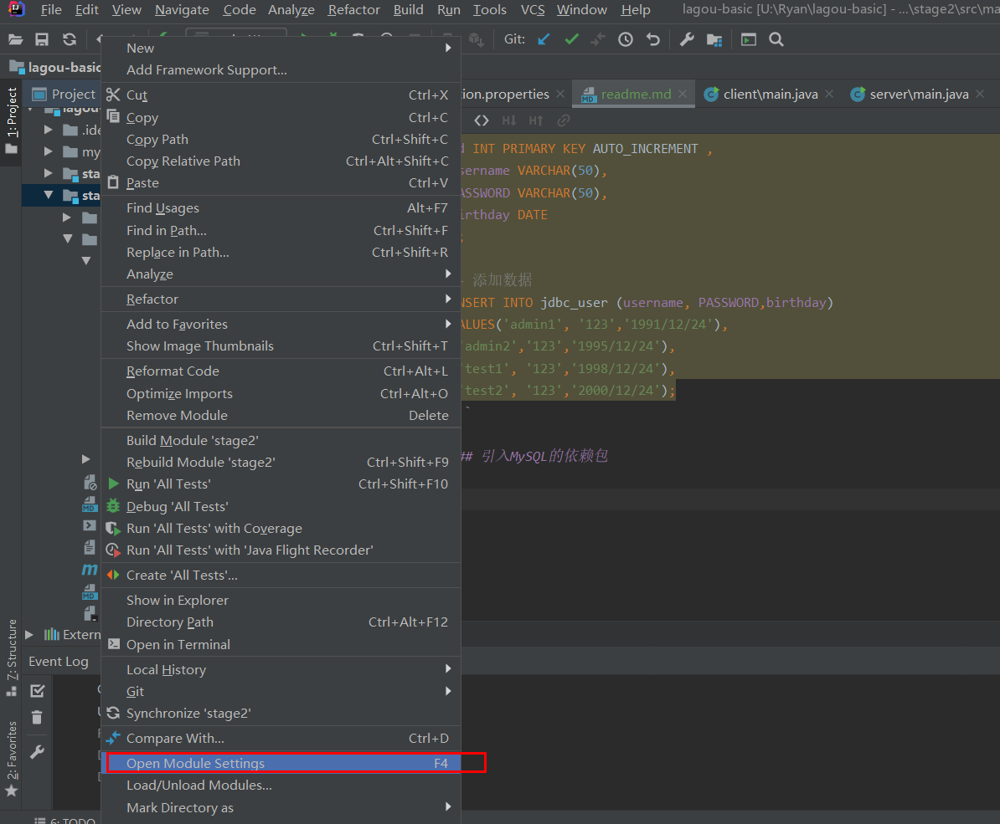
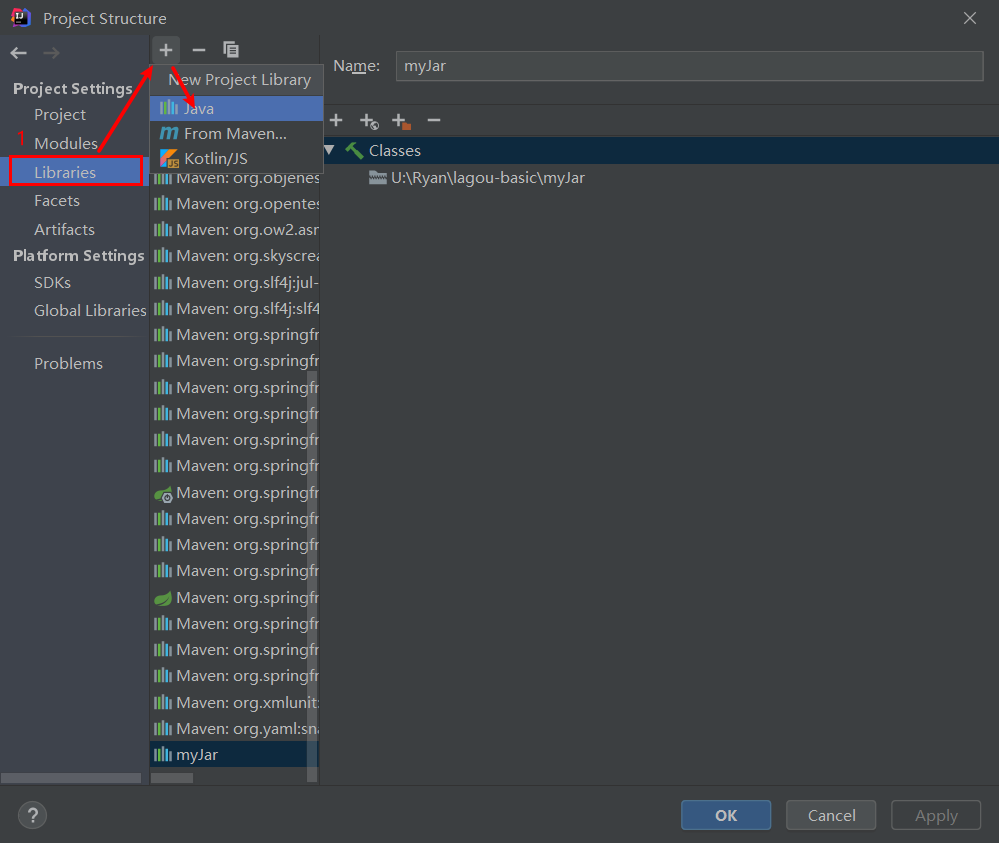
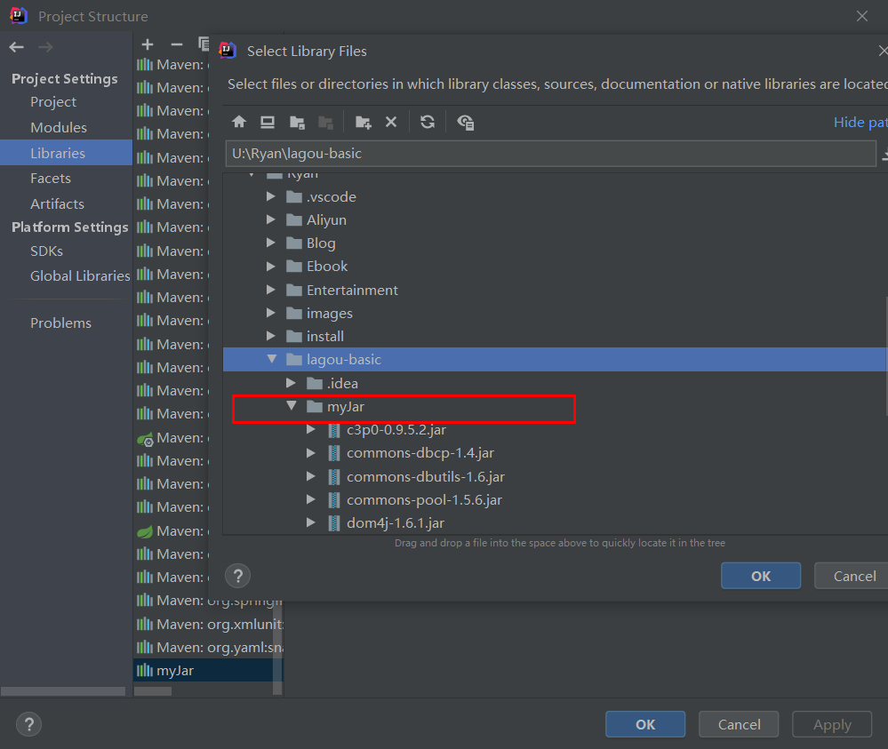
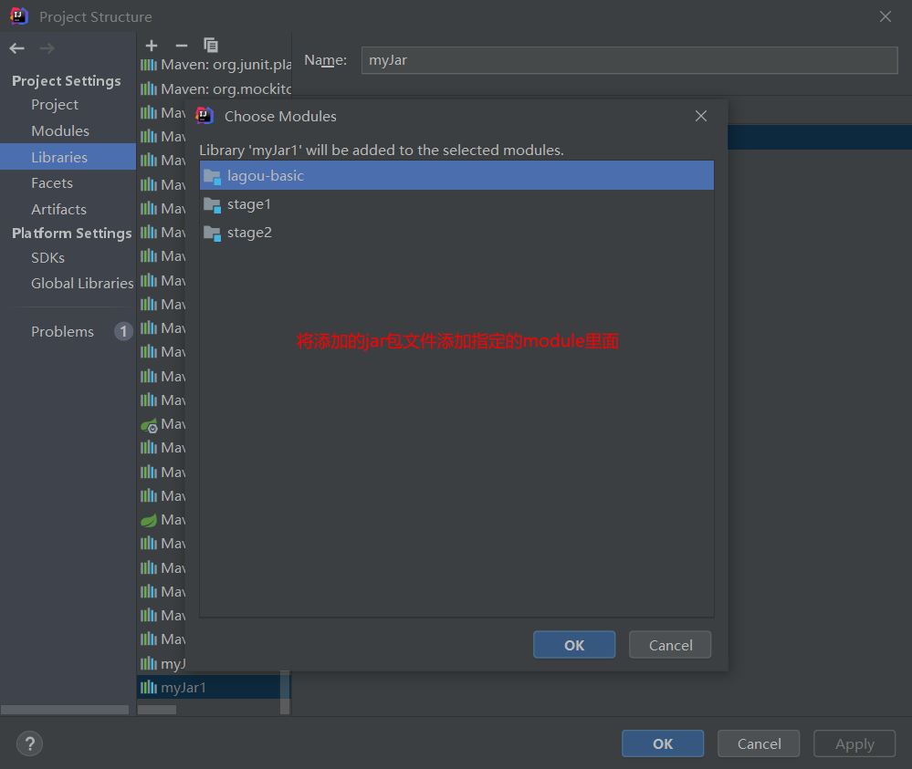
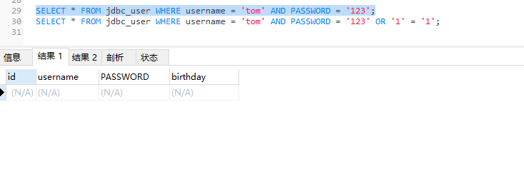
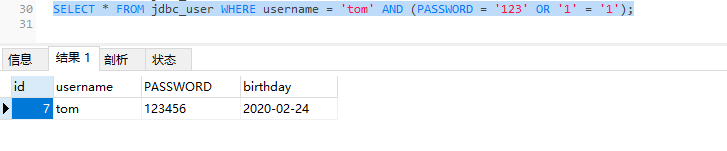

# JDBC和xml

## 什么是JDBC

Java Data Base Connectivity, Java访问数据库一种标准规范，是一种用于执行SQL语句的Java API。
可以为多种关系数据库提供统一的访问，由一组Java编写的类和接口组成。是Java访问的规范。

## JDBC的原理

本身就是一组接口，各大厂商各自通过这组接口，提供给开发者操作自家数据库的方法。（面向接口编程）

## JDBC总结

JDBC就是由sun公司定义的一套操作所有关系型数据库的规则(接口)，而数据库厂商需要实现这套接口,提供数据库
驱动jar包, 我们可以使用这套接口编程,真正执行的代码是对应驱动包中的实现类。

## JDBC开发

### 数据的准备

```sql
# 创建数据库JDBC，并设置编码格式UTF-8
CREATE DATABASE JDBC DEFAULT CHARACTER SET utf8;

# 切换到JDBC数据库
USE JDBC;

-- 创建 jdbc_user表
CREATE TABLE jdbc_user (
id INT PRIMARY KEY AUTO_INCREMENT ,
username VARCHAR(50),
PASSWORD VARCHAR(50),
birthday DATE
);

-- 添加数据
INSERT INTO jdbc_user (username, PASSWORD,birthday)
VALUES('admin1', '123','1991/12/24'),
('admin2','123','1995/12/24'),
('test1', '123','1998/12/24'),
('test2', '123','2000/12/24');
```

### 引入MySQL的依赖包

- 打开module设置



- 添加jar包文件








### API使用

- 驱动注册

**JDBC规范定义驱动接口： java.sql.Driver**

**MySql驱动包提供了实现类： com.mysql.jdbc.Driver**

| 注册驱动 | 描述|
| :------- | :---|
|Class.forName(数据库驱动实现类) | 加载和注册数据库驱动,数据库驱动由数据库厂商MySql提供"com.mysql.jdbc.Driver"|

Java代码

```java
// 注册驱动
Class.forName("com.mysql.jdbc.Driver");
```

查看com.mysql.jdbc.Driver类的源码

```java
// mysql定义的Driver类实现java.sql.Driver提供的Driver类
public class Driver extends NonRegisteringDriver implements java.sql.Driver {
    public Driver() throws SQLException {
    }

    // 静态代码块，随着Driver类加载的时候进行加载
    static {
        try {
            DriverManager.registerDriver(new Driver());
        } catch (SQLException var1) {
            throw new RuntimeException("Can't register driver!");
        }
    }
}
```

**从 JDBC3 开始，目前已经普遍使用的版本。可以不用注册驱动而直接使用。 Class.forName 这句话可以省略。**


- 获取连接

**Connection 接口，代表一个连接对象 ,具体的实现类由数据库的厂商实现**

**使用 DriverManager类的静态方法,getConnection可以获取数据库的连接**

|获取连接的静态方法 | 说明|
|:----------------- | :---|
|Connection getConnection(String url, String user,String password) | 通过连接字符串和用户名,密码来获取数据库连接对象|

```java
// 1. 注册驱动(可省略)
Class.forName("com.mysql.jdbc.Driver");

// 2. 获取连接
String url = "jdbc:mysql://localhost:3306/JDBC?characterEncoding=UTF-8";
Connection connection = DriverManager.getConnection(url);
System.out.println(connection);
```

**URL解析**

 ```text
jdbc:mysql://localhost:3306/JDBC?characterEncoding=UTF-8

- 第一部分jdbc是协议，这是固定的；
- 第二部分mysql是子协议，就是数据库名称，连接mysql数据库，第二部分当然是mysql了；
- 第三部分是由数据库厂商规定的，我们需要了解每个数据库厂商的要求，mysql的第三部分分别由数据库服务器的IP地址（localhost）、端口号（3306），以及要使用的 数据库名称 组成。
- 第四部分？后面是参数
```

### 获取SQL语句执行对象

| Connection接口中的方法 | 说明|
| :--------------------- | :---|
|Statement createStatement() | 创建 SQL语句执行对象|

**Statement ： 代表一条语句对象，用于发送 SQL 语句给服务器，用于执行静态 SQL 语句并返回它所生成结果的对象。**

| 常用方法 | 说明|
| :------- | :---|
|int executeUpdate(String sql); | 执行insert update delete语句.返回int类型,代表受影响的行数|
|ResultSet executeQuery(String sql); | 执行select语句, 返回ResultSet结果集对象|

Java代码

```java
// 1. 注册驱动(可省略)
Class.forName("com.mysql.jdbc.Driver");

// 2. 获取连接
String url = "jdbc:mysql://localhost:3306/JDBC?characterEncoding=UTF-8";
Connection connection = DriverManager.getConnection(url);
System.out.println(connection);

// 3. 获取statement对象
Statement statement = connection.createStatement();

// 4. 执行sql语句
String sql = "select * from JDBC";
ResultSet resultSet = statement.executeQuery(sql);


// 关闭资源
statement.close();
connection.close();
```

### 处理接口集

ResultSet接口

作用：封装数据库查询的结果集，对结果集进行遍历，取出每一条记录。

| ResultSet接口方法 | 说明 |
| :---------------- | :--- |
| boolean next() | 1) 游标向下一行 2) 返回 boolean 类型，如果还有下一条记录，返回 true，否则返回 false | 
| xxx getXxx( String or int) | 1) 通过列名，参数是 String 类型。返回不同的类型 2) 通过列号，参数是整数，从 1 开始。返回不同的类型 |

```java
    public static void main(String[] args) throws ClassNotFoundException, SQLException {
        // 1. 注册驱动(可省略)
        Class.forName("com.mysql.jdbc.Driver");

        // 2. 获取连接
        String url = "jdbc:mysql://localhost:3306/JDBC?characterEncoding=UTF-8";
        Connection connection = DriverManager.getConnection(url);
        System.out.println(connection);

        // 3. 获取statement对象
        Statement statement = connection.createStatement();

        // 4. 执行sql语句
        String sql = "select * from JDBC";
        ResultSet resultSet = statement.executeQuery(sql);

        // 4.1 判断是否有下一个元素
        boolean next = resultSet.next();

        // 4.2 获取列名为id的值
        int id = resultSet.getInt("id");
        System.out.println(id);

        // 4.3 使用循环的方式遍历
        while(resultSet.next()){
            //获取id
            int ids = resultSet.getInt("id");

            //获取姓名
            String username = resultSet.getString("username");

            //获取生日
            Date birthday = resultSet.getDate("birthday");
            System.out.println(ids + " = " +username + " : " + birthday);
        }

        // 关闭资源
        resultSet.close();
        statement.close();
        connection.close();
    }
```

### 释放资源

1) 需要释放的对象：ResultSet 结果集，Statement 语句，Connection 连接
2) 释放原则：先开的后关，后开的先关。ResultSet ==> Statement ==> Connection
3) 放在哪个代码块中：finally 块

   与IO流一样，使用后的东西都需要关闭！关闭的顺序是先开后关, 先得到的后关闭，后得到的先关闭


## JDBCUtil工具类编写

一个功能经常用到，那我们将这个功能提取出来封装成一个工具类，方便继续调用。

```java
public class JDBCUtil {

    // 1. 定义常量字符串
    private final static String URL = "jdbc:mysql://localhost:3306/JDBC?characterEncoding=UTF-8";
    private final static String DRIVERNAME = "com.mysql.jdbc.Driver";
    private final static String USER = "root";
    private final static String PASSWORD = "123456@Fuyi.com";

    // 2. 定义静态代码块
    static {
        try {
            Class.forName(DRIVERNAME);
        } catch (ClassNotFoundException e) {
            e.printStackTrace();
        }
    }

    // 3. 获取连接的静态方法
    public static Connection getConnection() {
        try {
            return DriverManager.getConnection(URL);
        } catch (SQLException e) {
            e.printStackTrace();
            return null;
        }
    }

    // 4. 关闭资源方法
    public static void close(Connection connection, Statement statement) {
        if (null != connection && null != statement) {
            try {
                connection.close();
                statement.close();
            } catch (SQLException e) {
                e.printStackTrace();
            }
        }
    }

    public static void close(Connection connection, Statement statement, ResultSet resultSet) {
        if (null != resultSet) {
            try {
                resultSet.close();
                close(connection, statement);
            } catch (SQLException e) {
                e.printStackTrace();
            }
        }
    }
}
```

## DML操作

```java
public static void main(String[] args) throws SQLException {

        Connection connection = JDBCUtil.getConnection();
        Statement statement = connection.createStatement();

        // 1. 插入操作
        String sql = "insert into jdbc_user values(null,'张百万','123','2020/1/1')";
        int resultSet = statement.executeUpdate(sql);
        System.out.println(resultSet);                                 // 1为插入成功

        // 2. 更新操作
        String update = "update jdbc_user set username = 'fuyi' where id = 1";
        System.out.println(statement.executeUpdate(update));            //  1为更新成功

        // 3. 删除操作
        statement.executeUpdate("delete from jdbc_user where id in(3,4)");
    
        JDBCUtil.close(connection, statement);
    }
```

## DQL操作

```java
public static void main(String[] args) throws SQLException {

        Connection connection = JDBCUtil.getConnection();
        Statement statement = connection.createStatement();

        // 1. 查询所有记录
        String search = "select * from jdbc_user WHERE username = '张百万';";
        ResultSet resultSet = statement.executeQuery(search);
        //2.处理结果集
        while(resultSet.next()){
            //通过列名 获取字段信息
            int id = resultSet.getInt("id");
            String username = resultSet.getString("username");
            String password = resultSet.getString("password");
            String birthday = resultSet.getString("birthday");
            System.out.println(id+" "+username+" " + password +" " + birthday);
        }

        JDBCUtil.close(connection, statement);
    }
```

## SQL注入

例子演示

```sql
SELECT * FROM jdbc_user WHERE username = 'tom' AND PASSWORD = '123';
```

查询结果



```sql
SELECT * FROM jdbc_user WHERE username = 'tom' AND (PASSWORD = '123' OR '1' = '1');
```

查询结果



sql注入的方式就是
```text
Sql注入方式: 123' or '1'=’1
```

## 解决sql注入问题

要解决 SQL 注入就不能让用户输入的密码和我们的 SQL 语句进行简单的字符串拼，总而言之，不能通过简单字符串连接

## 预处理对象

### PreparedStatement 接口介绍
- PreparedStatement 是 Statement 接口的子接口，继承于父接口中所有的方法。它是一个预编译的 SQL 语句对象.

- 预编译:  是指SQL 语句被预编译,并存储在 PreparedStatement 对象中。然后可以使用此对象多次高效地执行该语句。

### PreparedStatement 特点

- 因为有预先编译的功能，提高 SQL 的执行效率。

- 可以有效的防止 SQL 注入的问题，安全性更高

### API使用

- 获取PreparedStatement对象

| Connection 接口中的方法 | 说明 |
| :-------------------- | :--- |
|PreparedStatement prepareStatement(String sql) | 指定预编译的 SQL 语句，SQL 语句中使用占位符 ? 创建一个语句对象|

- 常用方法

|常用方法 | 说明|
|:------ | :---|
|int executeUpdate(); | 执行insert update delete语句.|
|ResultSet executeQuery(); | 执行select语句. 返回结果集对象 Resulet|

| setXxx重载方法 | 说明 |
| :------------ | :--- |
|void setDouble(int parameterIndex, double x) | 将指定参数设置为给定 Java double 值。|
|void setInt(int parameterIndex, int x) | 将指定参数设置为给定 Java int 值。|
|void setString(int parameterIndex, String x) | 将指定参数设置为给定 Java String 值。|
|void setObject(int parameterIndex, Object x) | 使用给定对象设置指定参数的值。|


代码实现

```java
 public static void main(String[] args) throws SQLException {
        Scanner sc = new Scanner(System.in);
        System.out.println("请输入用户名: ");
        String name = sc.nextLine();
        System.out.println("请输入密码: ");
        String pass = sc.nextLine();
        System.out.println(pass);
        //1.获取 PrepareStatement 预编译对象
        //1.1 编写SQL 使用 ? 占位符方式
        String sql = "select * from jdbc_user where username = ? and password = ?";
        Connection connection = JDBCUtil.getConnection();
        PreparedStatement preparedStatement = connection.prepareStatement(sql);
        //1.2 设置占位符参数
        preparedStatement.setString(1,name);
        preparedStatement.setString(2,pass);
        //2. 执行查询 处理结果集
        ResultSet resultSet = preparedStatement.executeQuery();
        if(resultSet.next()){
            System.out.println("登录成功! 欢迎您: " + name);
        }else{
            System.out.println("登录失败!");
        }

        //3.释放资源
        JDBCUtil.close(connection,preparedStatement,resultSet);
    }
```

### PreparedStatement的执行原理

Statement对象每次执行一条语句，就会将SQL发送给数据库，数据库需要先编译再执行；预处理对象会将SQL语句发送给数据进行预编译，然后引用预编译后的结果，这样只需要编译一次)。


## Statement 与 PreparedStatement的区别

1. Statement用于执行静态SQL语句，在执行时，必须指定一个事先准备好的SQL语句。

2. PrepareStatement是预编译的SQL语句对象，语句中可以包含动态参数“?”，在执行时可以为“?”动态设置参数
值。

3. PrepareStatement可以减少编译次数提高数据库性能(Statement对象每次执行一条语句，就会将SQL发送给数据库，数据库需要先编译再执行
与处理对象会将SQL语句发送给数据进行预编译，然后引用预编译后的结果，这样只需要编译一次)。

## JDBC 控制事务

### API

|方法 | 说明|
|:--- | :--|
|void setAutoCommit(boolean autoCommit) | 参数是 true 或 false 如果设置为 false，表示关闭自动提交，相当于开启事务|
|void commit() | 提交事务|
|void rollback() | 回滚事务|

### 开发流程

1. 获取连接
2. 开启事务
3. 获取到 PreparedStatement , 执行两次更新操作
4. 正常情况下提交事务
5. 出现异常回滚事务
6. 最后关闭资源

```java
//JDBC 操作事务
    public static void main(String[] args) {
        Connection con = null;
        PreparedStatement ps = null;
        try {
            //1. 获取连接
            con = JDBCUtil.getConnection();
            //2. 开启事务
            con.setAutoCommit(false);
            //3. 获取到 PreparedStatement 执行两次更新操作
            //3.1 tom 账户 -500
            ps = con.prepareStatement("update account set money = money - ? where name = ? ");
            ps.setDouble(1,500.0);
            ps.setString(2,"tom");
            ps.executeUpdate();
            //模拟tom转账后 出现异常
            System.out.println(1 / 0);
            //3.2 jack 账户 +500
            ps = con.prepareStatement("update account set money = money + ? where name = ? ");
            ps.setDouble(1,500.0);
            ps.setString(2,"jack");
            ps.executeUpdate();
            //4. 正常情况下提交事务
            con.commit();
            System.out.println("转账成功!");
        } catch (SQLException e) {
            e.printStackTrace();
            try {
                //5. 出现异常回滚事务
                con.rollback();
            } catch (SQLException ex) {
                ex.printStackTrace();
            }
        } finally {
            //6. 最后关闭资源
            JDBCUtil.close(con,ps);
        }
    }
```

# 数据库连接池

## 连接池

在实际的开发环境，获取连接和释放资源都是比较消耗系统资源的两个过程，为了解决这个问题，我们会首先创建一个
池子进行存放数据连接，从而达到共享connection。将数据库的链接和释放交给连接池去管理。

## 连接池的使用

Java提供了连接池接口javax.sql.DataSource，数据库厂商只要实现该接口就能让自家的数据库实现数据库连接池连接

常用的数据库连接池有：DBCP连接池、C3P0连接池和Druid连接池。

### 数据准备

```sql
# 创建数据库
CREATE DATABASE connectionPool CHARACTER SET utf8;

# 切换数据库
use connectionPool

# 创建员工表 
CREATE TABLE employee ( eid INT PRIMARY KEY AUTO_INCREMENT , ename VARCHAR (20), -- 员工姓名 
age INT , -- 员工年龄 
sex VARCHAR (6), -- 员工性别 
salary DOUBLE , -- 薪水 
empdate DATE -- 入职日期 
);

# 插入数据 
INSERT INTO employee (eid, ename, age, sex, salary, empdate) VALUES(NULL,'李清 照',22,'女',4000,'2018-11-12'); 
INSERT INTO employee (eid, ename, age, sex, salary, empdate) VALUES(NULL,'林黛 玉',20,'女',5000,'2019-03-14'); 
INSERT INTO employee (eid, ename, age, sex, salary, empdate) VALUES(NULL,'杜 甫',40,'男',6000,'2020-01-01'); 
INSERT INTO employee (eid, ename, age, sex, salary, empdate) VALUES(NULL,'李白',25,'男',3000,'2017-10-01');

# 查看所有数据信息
SELECT * FROM employee;
```

### DBCP数据库连接池

DBCP也是一个开源的连接池，是Apache成员之一，在企业开发中也比较常见，tomcat内置的连接池。

- 导入依赖

- 常见配置项

|属性 | 描述|
|:--- |:---- |
|driverClassName | 数据库驱动名称|
|url | 数据库地址|
|username | 用户名|
|password | 密码|
|maxActive | 最大连接数量|
|maxIdle | 最大空闲连接|
|minIdle | 最小空闲连接|
|initialSize | 初始化连接|

- DBCPUtil数据库连接池工具类

```java
/**
 * DBCP数据库连接池工具类
 */
public class DBCPUtil {

    //1.定义常量 保存数据库连接的相关信息
    public static final String DRIVERNAME = "com.mysql.jdbc.Driver";
    public static final String URL = "jdbc:mysql://175.24.16.47:3306/connectionPool?characterEncoding=UTF-8";
    public static final String USERNAME = "root";
    public static final String PASSWORD = "123456@Fuyi.com";

    //2. 创建DBCP连接池对象
    public static BasicDataSource dataSource = new BasicDataSource();

    //3. 静态代码块进行配置
    static {
        dataSource.setDriverClassName(DRIVERNAME);
        dataSource.setUrl(URL);
        dataSource.setUsername(USERNAME);
        dataSource.setPassword(PASSWORD);
    }

    /**
     * 获取连接
     *
     * @return
     * @throws SQLException
     */
    public static Connection getConnection () throws SQLException {
        return dataSource.getConnection();
    }

    /**
     * 释放资源
     *
     * @param connection
     * @param statement
     * @throws SQLException
     */
    public static void close(Connection connection, Statement statement) throws SQLException {
        if (null != connection && null != statement) {
            statement.close();
            // 归还连接
            connection.close();
        }
    }

    public static void close(Connection connection, Statement statement, ResultSet resultSet) throws SQLException {
        if (null != resultSet) {
            resultSet.close();
            close(connection, statement);
        }
    }
}
```

DBCPUtil测试类

```java
public static void main(String[] args) {

        try {
            //1. 获取连接
            Connection connection = DBCPUtil.getConnection();

            //2. 获取SQL执行对象
            Statement statement = connection.createStatement();

            //3. SQL语句
            String sql = "SELECT * FROM employee;";

            //4. 执行SQL语句
            ResultSet resultSet = statement.executeQuery(sql);

            //5. 打印结果
            while (resultSet.next()) {
                String ename = resultSet.getString("ename");
                System.out.println("员工姓名: " + ename);
            }

            //6. 关闭资源
            DBCPUtil.close(connection, statement);

        } catch (SQLException e) {
            e.printStackTrace();
        }
    }
```


### C3P0连接池

C3P0是一个开源的JDBC连接池,支持JDBC3规范和JDBC2的标准扩展。目前使用它的开源项目有Hibernate、Spring等。


